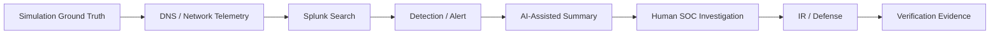

# Scenario Matrix

The four scenarios use one permanent lab foundation and add only the scenario-specific components and telemetry they need.

| # | Scenario | DNS / network behavior | Detection focus | MITRE ATT&CK | Response objective |
|---|---|---|---|---|---|
| 01 | DNS Reconnaissance & Enumeration | Multiple A, AAAA, MX, NS, TXT and CNAME/alias observations; authority/recursion observations; follow-up web activity | Record-type diversity, query rate, unique names, source behavior, DNS-to-web correlation | T1590.002 — Gather Victim Network Information: DNS | Identify source and scope; reduce unnecessary exposure; verify the control |
| 02 | DGA + High NXDOMAIN | Many generated/random-looking names and failed resolutions through the defender-visible resolver path | NXDOMAIN ratio, domain length/randomness, query volume, unique domains, client/process context | T1568.002 — Dynamic Resolution: Domain Generation Algorithms | Identify the affected client, introduce the reusable resolver/sinkhole capability, contain controlled DGA behavior when appropriate and verify the result |
| 03 | Fast Flux DNS | One name resolves to changing IP addresses with short TTLs | Answer churn, TTL, unique destination count, time correlation and network flows | T1568.001 — Dynamic Resolution: Fast Flux DNS | Detect changing infrastructure, investigate connections and prevent access to the controlled malicious namespace |
| 04 | DNS Tunneling | Long/encoded harmless labels and unusual query patterns | Label length, entropy/randomness, TXT/A activity, query size/frequency, repeated parent domain and endpoint/network relationship | T1071.004 — Application Layer Protocol: DNS; T1572 where the implemented behavior fits | Isolate/contain the source, reuse the defender-controlled sinkhole/block path and prove the tunneling behavior stops |

## Shared telemetry available before Scenario 01

The infrastructure repository now provides trusted Web and AWS telemetry before any scenario-specific detection work begins. This includes Route 53 public authoritative logs, VPC Flow Logs, CloudTrail and **AWS VPC Resolver Query Logs** for both existing VPCs.

AWS VPC Resolver logging is shared telemetry only. It does not mean the Scenario 02 defender resolver has been built. The team-controlled `dns-soc-resolver01`, `dns-soc-victim01` and sinkhole path remain Scenario 02 additions.

## Infrastructure delta by scenario

The base VPC/DNS/Splunk platform is reused rather than rebuilt.

| Scenario | Additional infrastructure decision |
|---|---|
| **01** | None; shared AI foundation is complete and Scenario 01 reuses the common platform |
| **02** | Build `dns-soc-resolver01`, `dns-soc-victim01`, DNS/victim SGs and reusable sinkhole capability in `SOC-MONITORING-SUBNET` |
| **03** | Reuse Scenario 02 systems; add only temporary team-controlled Fast Flux destinations and DNS records/TTL behavior |
| **04** | Reuse Scenario 02 systems; add controlled tunneling DNS behavior and only add a dedicated authoritative service if the final implementation requires it |

See [`scenario-infrastructure-roadmap.md`](scenario-infrastructure-roadmap.md) for the full future build plan.

## DNS setup timing

The public child zone is not rebuilt for every scenario. Its permanent five-record baseline is documented in [`scenario-dns-plan.md`](scenario-dns-plan.md). Scenario-specific DNS behavior is introduced only when needed:

- **Scenario 01:** uses the existing A/NS/SOA/TXT/CNAME baseline; no extra Route 53 record is required.
- **Scenario 02:** introduces the team-controlled resolver/victim path. Generated names are intentionally left nonexistent so NXDOMAIN behavior can be measured. The internal sinkhole capability is established here for later IR reuse.
- **Scenario 03:** a temporary controlled `flux.soclab...` A RRset and short TTL are created later when team-controlled endpoints exist.
- **Scenario 04:** the tunneling namespace uses the controlled resolver/DNS path; the sinkhole/block capability is reused as the explicit final containment proof.
- **Sinkhole:** internal defender infrastructure at `10.50.30.30`, not a permanent public Route 53 record.

## Scenario design rule

MITRE mapping follows the **behavior actually generated and detected**. A technique is not added just because it sounds related. If the implementation changes, the mapping is reviewed before the scenario is marked complete.

## Common evidence model

Every scenario should eventually collect enough evidence for this chain:

The AI step is enrichment only. Raw telemetry and the human investigation remain the source of truth.

## Scenario repository standard

All four scenario repositories use the common workflow in [`scenario-documentation-standard.md`](scenario-documentation-standard.md), including the 20 required documentation areas, network/protocol view, dashboard engineering pattern, MITRE discipline and evidence rules.
