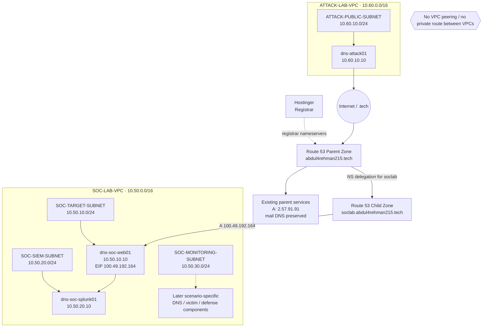

# Base Network Architecture

## Design objective

Keep the attacker network logically separate from the SOC network while still allowing realistic public-facing DNS and web interaction. Internal SOC communication stays inside `SOC-LAB-VPC`; the attacker does not receive a private route to `10.50.0.0/16`.

Public DNS is also separated by responsibility: Hostinger remains the registrar, Route 53 is authoritative for the parent domain, and a separate Route 53 child zone serves the SOC lab namespace.

## VPC and public DNS layout



The DNS authority chain is documented in more detail in [`dns-authority-and-delegation.md`](dns-authority-and-delegation.md).

## Trust boundaries

### Public attack boundary

`ATTACK-LAB-VPC` is a separate address space with its own Internet Gateway and public route table. The attack host reaches public lab services through the Internet. It does not route directly to SOC private addresses.

### Public DNS boundary

The parent and child Route 53 zones have separate authoritative nameserver sets. The parent zone owns `abdul4rehman215.tech` and delegates only `soclab.abdul4rehman215.tech` to the child zone. This creates a visible DNS authority boundary without changing the VPC separation model.

### Public target boundary

`SOC-TARGET-SUBNET` is where intentionally public lab services are placed. `soclab.abdul4rehman215.tech` resolves to the Elastic IP associated with `dns-soc-web01`. Exposure is controlled by service-specific security groups rather than opening the entire VPC.

### SIEM boundary

`SOC-SIEM-SUBNET` contains Splunk and the AI bridge as they are deployed. Splunk Web is restricted to the team rather than exposed as a general public service. Log ingestion ports are allowed only from approved sources.

### Monitoring boundary

`SOC-MONITORING-SUBNET` uses the private SOC route table. It is reserved for later DNS/victim/defense components that should not be directly reachable from the Internet.

## Routing principle

```text
SOC public subnets     -> 0.0.0.0/0 -> SOC-LAB-IGW
SOC monitoring subnet -> local VPC route only
Attack public subnet  -> 0.0.0.0/0 -> ATTACK-LAB-IGW
```

No VPC peering, Transit Gateway or cross-VPC private route is part of the base design.
