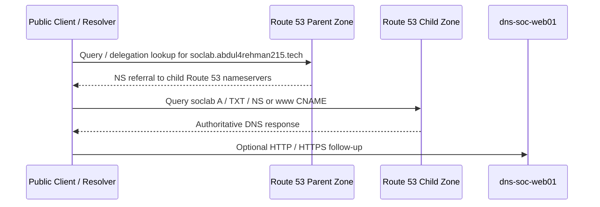
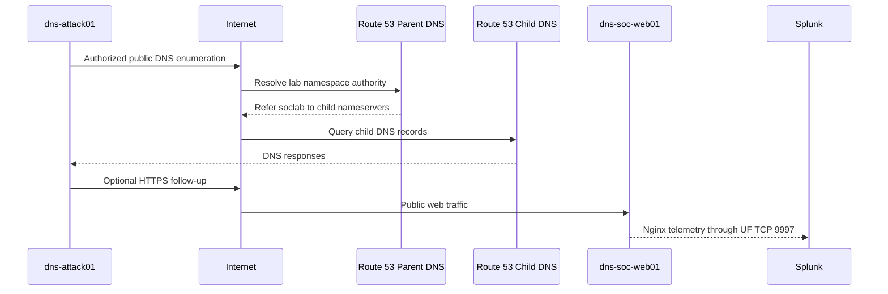
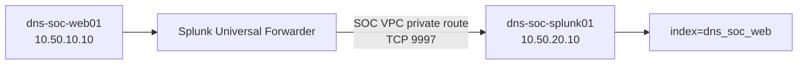
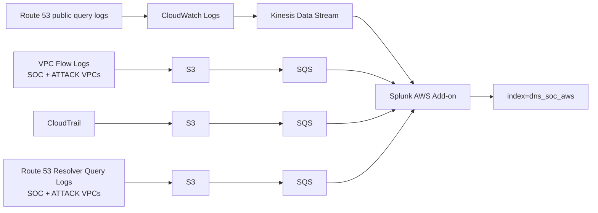

# Traffic Flow

The lab has separate paths for public DNS, public scenario activity, SOC administration, Web telemetry, AWS telemetry and later defender-controlled DNS work.

## Public DNS resolution path



The parent zone owns the delegation. The child zone owns the lab A record, the `www` CNAME and the training TXT fixture. Both web hostnames ultimately reach `dns-soc-web01`.

## Scenario 01 public path



The attack host reaches the public namespace without a private route into `SOC-LAB-VPC`. This preserves the intended network boundary while still creating useful DNS, web and VPC-flow evidence.

## Team management path

```text
Team browser -> Internet -> Splunk Web :8000
                         -> restricted to approved team source IPs

Team admin   -> AWS Systems Manager -> EC2
             -> no general-purpose public SSH required
```

## Completed Web telemetry path



The project monitors the required Nginx files rather than all of `/var/log`. Controlled successful and failed HTTP requests were generated only to validate data onboarding; they are not treated as the Scenario 01 attack simulation.

## Completed AWS telemetry paths



The real Splunk sourcetypes are documented in [`../03-splunk-build/06-aws-telemetry-onboarding.md`](../03-splunk-build/06-aws-telemetry-onboarding.md).

## Public authoritative DNS vs VPC Resolver logging

These are different visibility points:

```text
Public Internet query
    -> Route 53 authoritative nameserver
    -> public Route 53 query log

EC2 workload using AWS-provided DNS
    -> VPC Resolver
    -> Resolver Query Log
```

A direct query explicitly sent to a Route 53 authoritative nameserver may bypass the VPC Resolver, so the two log families are not expected to contain identical activity.

## Later defender-controlled DNS path

Scenario 02 introduces a team-controlled resolver inside the monitoring subnet:

```text
dns-soc-victim01
        |
        | DNS :53
        v
dns-soc-resolver01
        |
        +--> upstream DNS
        |
        +--> defender-side query logs -> Splunk
        |
        +--> later sinkhole / block decision
```

That later path is separate from the AWS VPC Resolver Query Logging already enabled during Gate C.
