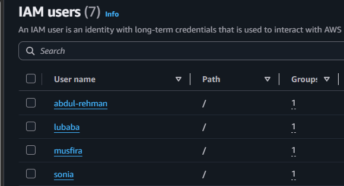
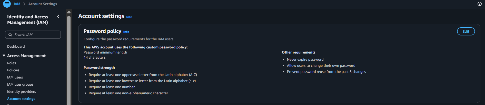
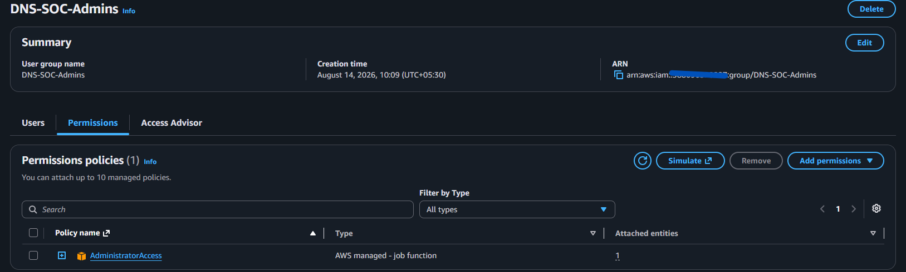
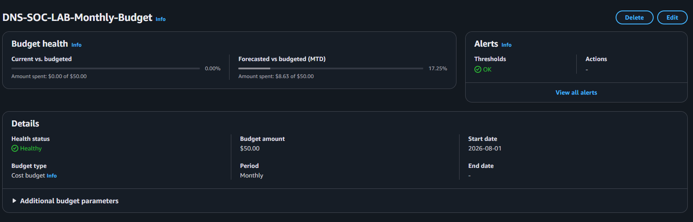

# AWS Account Security and Access

**Status:** Implemented  
**Implementation owner:** Abdul-Rehman  
**Region used for the lab:** `us-east-1`

## Objective

Give each team member accountable AWS access without using the root user for daily work, require stronger authentication, and add basic cost protection before launching lab infrastructure.

## Implemented controls

- Separate IAM identities for the four project members.
- `DNS-SOC-Admins` group with the AWS-managed `AdministratorAccess` policy for the lab team.
- Custom IAM password policy.
- MFA configured for project access; MFA setup secrets are intentionally not stored in the repository.
- Root / user access keys are not part of the lab workflow.
- Monthly AWS budget created for cost visibility.
- EC2 Systems Manager role prepared for SSM-based instance administration.

## Why we used separate identities

Individual IAM identities preserve accountability. Later, CloudTrail can show which AWS identity performed a change instead of attributing every action to one shared root login.

## Evidence

IAM project users

IAM password policy

DNS-SOC-Admins permissions

AWS monthly budget

MFA QR codes, authentication secrets and credential material are deliberately excluded from public evidence.

## Result

The AWS account is ready for team-based lab administration with individual identities, MFA, cost monitoring and an SSM role available for the EC2 phase.
