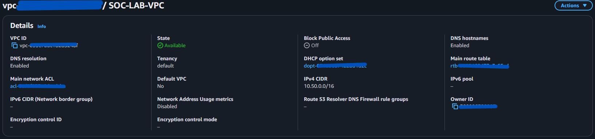
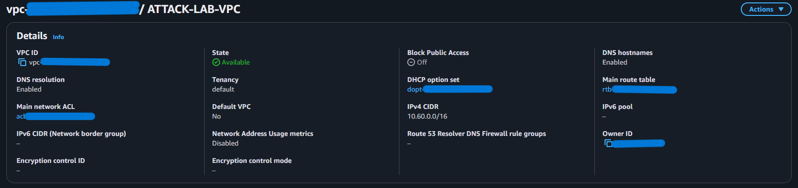
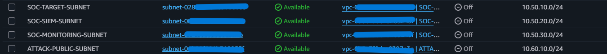
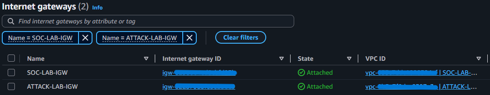
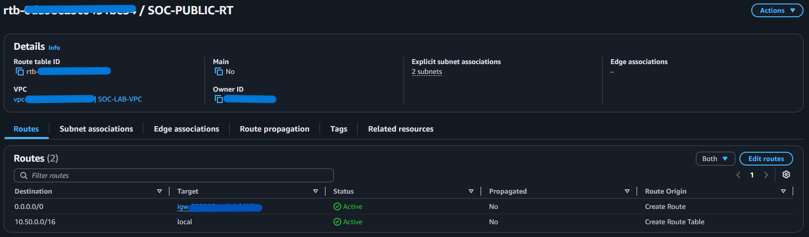
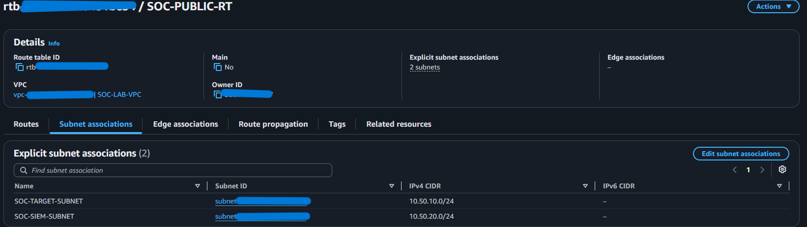
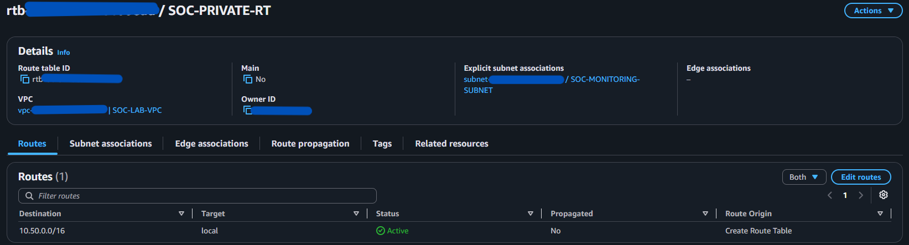
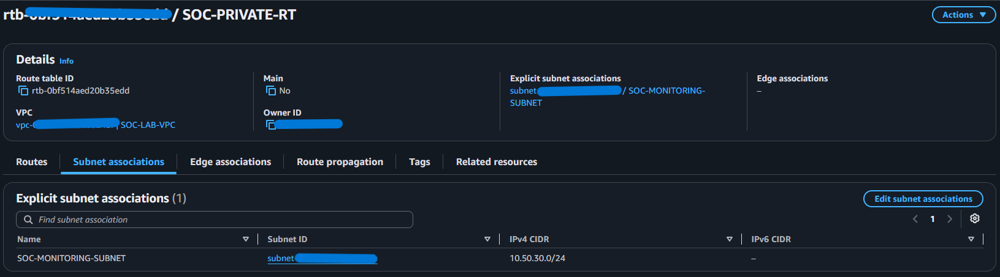
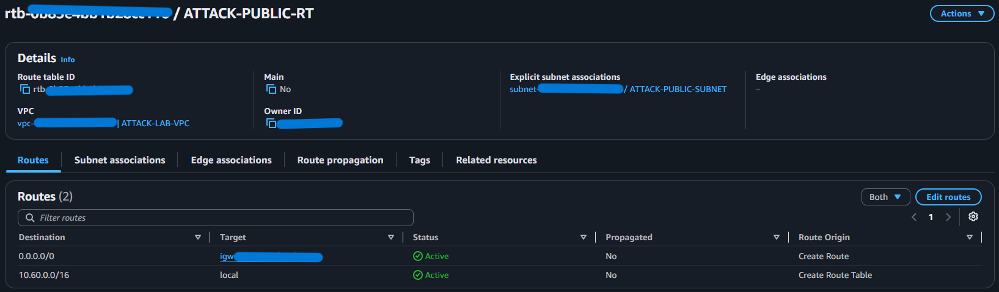
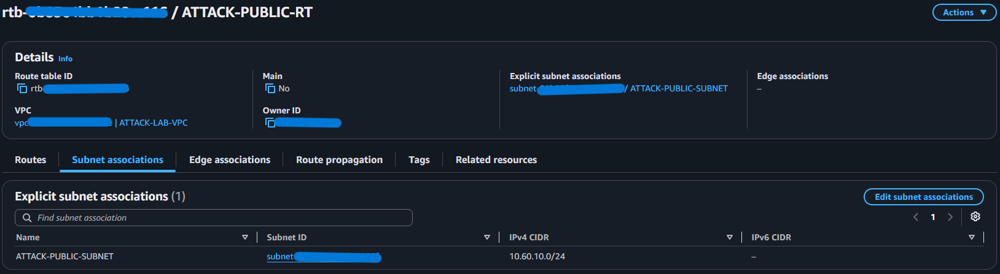

# VPC, Subnets and Routing

**Status:** Implemented  
**Implementation owner:** Abdul-Rehman  
**Region:** `us-east-1`

## Objective

Build the network foundation manually instead of relying on the default VPC. The attacker and SOC environments use non-overlapping address spaces and have no private peering route between them.

## VPCs

| VPC | CIDR |
|---|---|
| `SOC-LAB-VPC` | `10.50.0.0/16` |
| `ATTACK-LAB-VPC` | `10.60.0.0/16` |

## Subnets

| Subnet | CIDR | VPC | Routing purpose |
|---|---|---|---|
| `SOC-TARGET-SUBNET` | `10.50.10.0/24` | SOC | Public target subnet |
| `SOC-SIEM-SUBNET` | `10.50.20.0/24` | SOC | Public SIEM subnet with restricted service exposure |
| `SOC-MONITORING-SUBNET` | `10.50.30.0/24` | SOC | Private monitoring/defense subnet |
| `ATTACK-PUBLIC-SUBNET` | `10.60.10.0/24` | Attack | Public attack/simulation subnet |

## Internet Gateways

Each VPC has its own IGW:

- `SOC-LAB-IGW` → `SOC-LAB-VPC`
- `ATTACK-LAB-IGW` → `ATTACK-LAB-VPC`

## Route tables

### `SOC-PUBLIC-RT`

```text
10.50.0.0/16 -> local
0.0.0.0/0    -> SOC-LAB-IGW
```

Associated with:
- `SOC-TARGET-SUBNET`
- `SOC-SIEM-SUBNET`

### `SOC-PRIVATE-RT`

```text
10.50.0.0/16 -> local
```

Associated with:
- `SOC-MONITORING-SUBNET`

There is no default Internet route on the private monitoring subnet.

### `ATTACK-PUBLIC-RT`

```text
10.60.0.0/16 -> local
0.0.0.0/0    -> ATTACK-LAB-IGW
```

Associated with:
- `ATTACK-PUBLIC-SUBNET`

## VPC separation

No VPC peering, Transit Gateway or custom `10.60.0.0/16 <-> 10.50.0.0/16` route is configured. This forces the attacker to use public lab services instead of private SOC addresses.

## Evidence

<details>
<summary>VPCs and subnets</summary>







</details>

<details>
<summary>Internet Gateways</summary>



</details>

<details>
<summary>SOC public route table</summary>





</details>

<details>
<summary>SOC private route table</summary>





</details>

<details>
<summary>Attack public route table</summary>





</details>

## Result

The network foundation now matches the locked design: two isolated VPCs, explicit subnets, separate IGWs, public routing only where intended, and a private monitoring subnet reserved for later scenario components.
