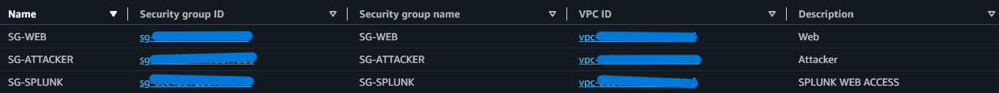
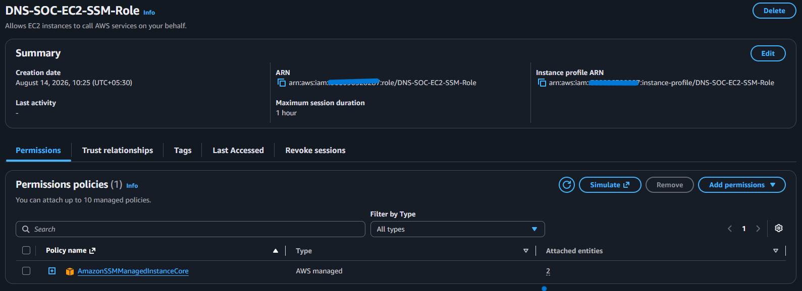

<!-- dns-soc-nav:start -->
[🏠 Repository Home](../README.md) · [📁 02 Aws Build](README.md)
<!-- dns-soc-nav:end -->


# Security Groups and Systems Manager

- **Status:** Implemented and validated
- **Implementation owner:** [_Abdul-Rehman_](https://github.com/abdul4rehman215)
## Objective

Control service exposure with Security Groups and administer EC2 through AWS Systems Manager so general-purpose SSH does not need to be opened to the Internet.

## Security group baseline

The original shared build used three role groups: `SG-WEB`, `SG-SPLUNK` and `SG-ATTACKER`. Scenario 02 later added `SG-DNS`, `SG-VICTIM` and `SG-SINKHOLE`.



*The original security-group inventory confirms the shared Web/Splunk/attacker role separation. Scenario 02 group evidence is kept with its own build record.*

The rule design is documented in [`../01-network-architecture/security-groups.md`](../01-network-architecture/security-groups.md). The implementation keeps exposure service-specific: the web target is the intentionally public service, Splunk Web is restricted to approved team access, and the attacker host does not require a public inbound management port.

## Scenario 02 security-group expansion

The completed defender-DNS build added:

```text
SG-DNS
  UDP/TCP 53 <- SG-VICTIM

SG-VICTIM
  no inbound application service

SG-SINKHOLE
  TCP 80 <- SG-VICTIM

SG-SPLUNK
  TCP 9997 <- SG-DNS
  TCP 9997 <- SG-VICTIM
  TCP 9997 <- SG-SINKHOLE
```

`SG-VICTIM -> SG-SPLUNK:9997` is reserved for a future victim forwarder; no victim UF was installed during the infrastructure build. DNS 53 was not exposed publicly.

See [`08-scenario-02-defender-dns.md`](08-scenario-02-defender-dns.md).

## Systems Manager role

`DNS-SOC-EC2-SSM-Role` was created for Systems Manager-managed EC2 access.



*The instance role provides the AWS-side identity used by the project EC2 systems for SSM administration.*

## Runtime validation

The role is attached to the shared Scenario 01 EC2 instances and the three Scenario 02 private EC2 instances and Session Manager access has been successfully used during host validation. This confirms that normal administration can be performed without opening SSH as the default management path.

Runtime screenshots for the three hosts are kept with the EC2 deployment record:

- [Web SSM validation](screenshots/ec2-deployment/web-ssm-validation.png)
- [Splunk SSM validation](screenshots/ec2-deployment/splunk-ssm-validation.png)
- [Attacker SSM validation](screenshots/ec2-deployment/attacker-ssm-validation.png)

## Result

The security-group baseline, Scenario 02 role groups and SSM management path are active. Shared and private defender hosts can be administered through Systems Manager while public service exposure remains controlled by role-specific security groups.

## Evidence index

- [Security groups](screenshots/network-foundation/security-groups.png)
- [EC2 SSM role](screenshots/account-security/ec2-ssm-role.png)
- [EC2 deployment and SSM validation](04-ec2-deployment.md)


<!-- dns-soc-footer:start -->
<div align="center">

[🏠 Repository Home](../README.md) · [📁 02 Aws Build](README.md)

<sub>DNSentinel Lab · Controlled DNS security training documentation</sub>

</div>
<!-- dns-soc-footer:end -->
