# Nginx HTTPS Web Server

- **Status:** Implemented and validated
- **Implementation Owner:** Musfira
- **AWS Service:** Amazon EC2 / Nginx / Let's Encrypt
- **EC2 Instance:** `dns-soc-web01`
- **Private IP:** `10.50.10.10`
- **Elastic IP:** `100.49.192.164`
- **Public Hostnames:** `soclab.abdul4rehman215.tech`, `www.soclab.abdul4rehman215.tech`

---

## 1. Overview

This phase deploys the public web server for the DNS SOC Security Lab on the AWS EC2 instance `dns-soc-web01`.

The web server uses Nginx to serve the SOC lab landing page and provides HTTPS access using a Let's Encrypt certificate.

### Public Hostnames

- `soclab.abdul4rehman215.tech`
- `www.soclab.abdul4rehman215.tech`

### Web Server

| Parameter | Value |
|---|---|
| EC2 Instance | `dns-soc-web01` |
| Private IP | `10.50.10.10` |
| Elastic IP | `100.49.192.164` |
| Web Server | Nginx |
| HTTP | TCP/80 |
| HTTPS | TCP/443 |
| Document Root | `/var/www/dns-soc-lab` |
| Administration | AWS Systems Manager Session Manager |

---

## 2. Objective

The objectives of this phase are:

1. Install and configure Nginx on the web EC2 instance.
2. Deploy a custom DNS SOC Security Lab landing page.
3. Configure a dedicated Nginx virtual host.
4. Connect the public DNS hostname to the EC2 web server.
5. Enable HTTPS using Let's Encrypt.
6. Redirect HTTP traffic to HTTPS.
7. Validate the TLS certificate and SANs.
8. Verify automatic certificate renewal.
9. Configure site-specific Nginx access and error logs.
10. Generate successful and controlled failed requests for log validation.

---

## 3. Architecture

```text
                         Internet
                            |
                            v
                    Public DNS / Route 53
                            |
              +-------------+-------------+
              |                           |
              v                           v
   soclab.abdul4rehman215.tech     www.soclab.abdul4rehman215.tech
              |                           |
              |                           |
              +-------------+-------------+
                            |
                            v
                    100.49.192.164
                      Elastic IP
                            |
                            v
                     dns-soc-web01
                     10.50.10.10
                            |
                    +-------+-------+
                    |               |
                  :80             :443
                    |               |
                    v               v
                  HTTP            HTTPS
                    |               |
                    +-------+-------+
                            |
                          Nginx
                            |
                            v
                  /var/www/dns-soc-lab
                            |
                            v
                       index.html
```

HTTP traffic is redirected to HTTPS.

---

## 4. Pre-Deployment Validation

The EC2 instance was accessed through AWS Systems Manager Session Manager.

The following checks were performed:

```bash
hostnamectl
cat /etc/os-release
ip -br addr
ip route
timedatectl
df -h /
free -h
sudo ss -lntp
sudo ufw status
systemctl status amazon-ssm-agent --no-pager
curl -s https://checkip.amazonaws.com
```

The checks were used to confirm:

- Correct hostname
- Operating system
- Private IP configuration
- Routing
- System time
- Disk and memory availability
- Existing listening ports
- UFW status
- SSM agent health
- Public IP address

**Result**

The EC2 instance was healthy and reachable through SSM. UFW was inactive. The instance was ready for Nginx deployment.

**Evidence**

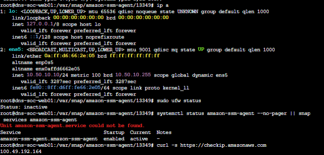

---

## 5. Nginx Installation

Nginx was installed using the Ubuntu package manager.

```bash
sudo apt update
sudo apt install -y nginx
```

The service was enabled and started:

```bash
sudo systemctl enable --now nginx
```

Configuration syntax was validated:

```bash
sudo nginx -t
```

Service status was checked:

```bash
sudo systemctl status nginx --no-pager
```

Port 80 was verified:

```bash
sudo ss -lntp | grep ':80'
```

**Result**

Nginx was successfully installed and running.

**Evidence**

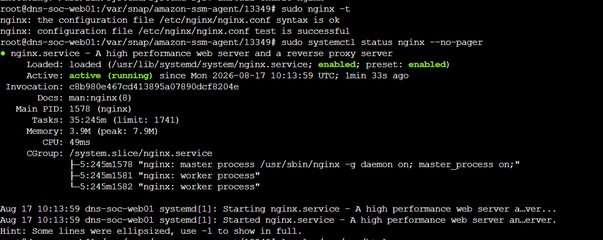

---

## 6. Custom SOC Landing Page

A dedicated document root was created:

```bash
sudo mkdir -p /var/www/dns-soc-lab
```

The website content was deployed as:

```
/var/www/dns-soc-lab/index.html
```

The source version of the page is maintained in:

```
configs/nginx/index.html
```

The page identifies the environment as **DNS SOC Security Lab**.

The page is intentionally a controlled training landing page and does not expose credentials, private keys, AWS secrets, or other sensitive information.

**Evidence**

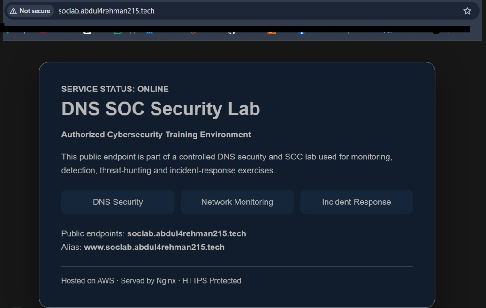

---

## 7. Nginx Virtual Host

A dedicated Nginx site configuration was created for the SOC lab domain.

The configuration source is maintained in:

```
configs/nginx/soclab.conf
```

The server names are:

```nginx
server_name soclab.abdul4rehman215.tech www.soclab.abdul4rehman215.tech;
```

The document root is:

```nginx
root /var/www/dns-soc-lab;
```

Site-specific logs are configured as:

```
/var/log/nginx/soclab_access.log
/var/log/nginx/soclab_error.log
```

Nginx configuration was validated with:

```bash
sudo nginx -t
```

**Evidence**

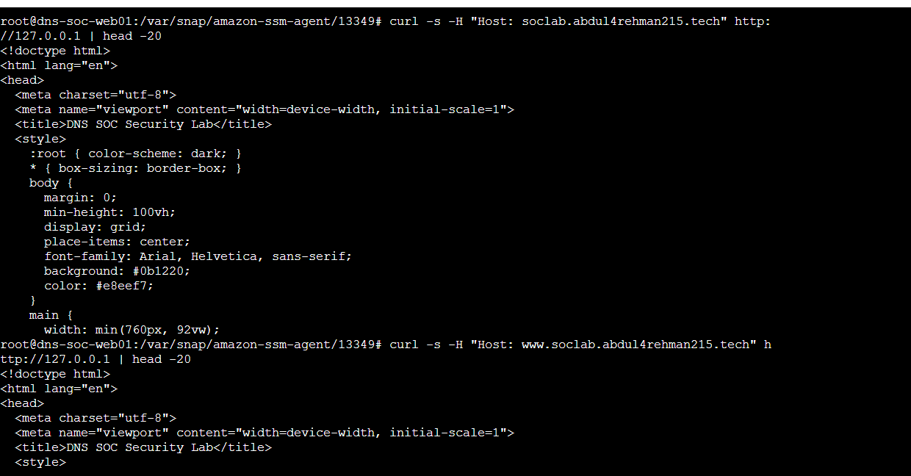

---

## 8. DNS Validation

The public DNS records were validated before HTTPS deployment.

**Primary hostname**

```bash
dig +short A soclab.abdul4rehman215.tech
```

Expected result:

```
100.49.192.164
```

**WWW hostname**

```bash
dig +short CNAME www.soclab.abdul4rehman215.tech
```

Expected result:

```
soclab.abdul4rehman215.tech.
```

The www hostname was also resolved to the public web-server address.

**Result**

Both public hostnames correctly resolved to the web server.

---

## 9. Public HTTP Validation

Before enabling HTTPS, the public web server was tested over HTTP.

```bash
curl -I http://soclab.abdul4rehman215.tech
curl -I http://www.soclab.abdul4rehman215.tech
```

The website content was also checked:

```bash
curl -s http://soclab.abdul4rehman215.tech | grep -i "DNS SOC Security Lab"
```

**Result**

Both hostnames successfully reached the Nginx web server and returned the DNS SOC Security Lab page.

**Evidence**


---

## 10. Let's Encrypt HTTPS

Certbot was installed to obtain and configure a publicly trusted TLS certificate.

```bash
sudo apt update
sudo apt install certbot python3-certbot-nginx -y
```

Certificate issuance was performed for both public hostnames:

```bash
sudo certbot --nginx \
-d soclab.abdul4rehman215.tech \
-d www.soclab.abdul4rehman215.tech
```

The certificate was successfully issued.

**Certificate Scope**

The certificate covers:

- `soclab.abdul4rehman215.tech`
- `www.soclab.abdul4rehman215.tech`

The certificate is associated with the DNS hostnames rather than the Elastic IP.

**Evidence**

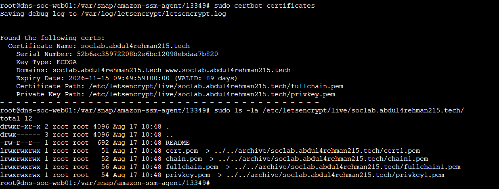

---

## 11. HTTPS Validation

Nginx was tested after HTTPS configuration:

```bash
sudo nginx -t
```

Port 443 was verified:

```bash
sudo ss -lntp | grep ':443'
```

The HTTPS endpoint was tested:

```bash
curl -I https://soclab.abdul4rehman215.tech
curl -I https://www.soclab.abdul4rehman215.tech
```

The website was also opened through a browser using HTTPS.

**Result**

Both hostnames successfully served the SOC landing page over HTTPS.

**Evidence**

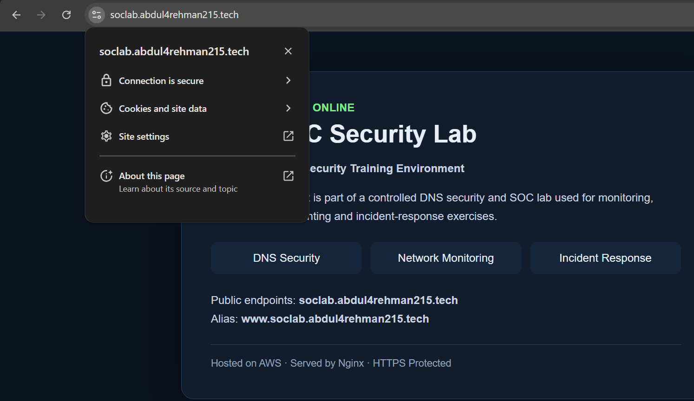

---

## 12. HTTP to HTTPS Redirect

HTTP requests were tested:

```bash
curl -I http://soclab.abdul4rehman215.tech
curl -I http://www.soclab.abdul4rehman215.tech
```

The HTTP endpoints returned a redirect to HTTPS.

Expected behavior:

```text
HTTP
  |
  | 301 Redirect
  v
HTTPS
```

**Evidence**

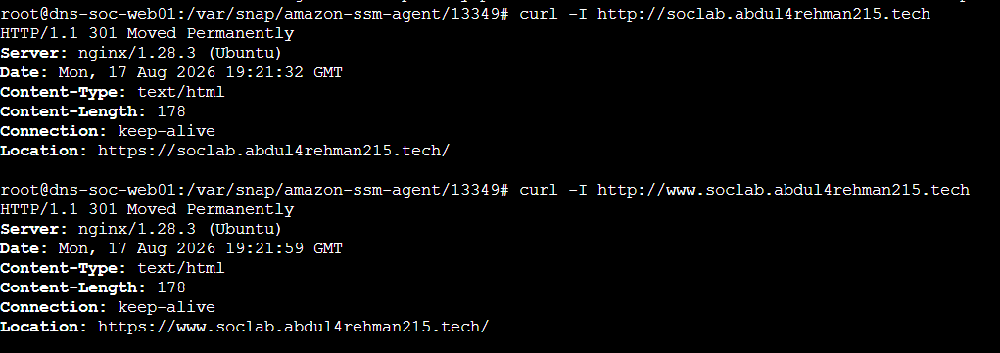

---

## 13. TLS Certificate and SAN Validation

Certificate details were inspected using OpenSSL:

```bash
echo | openssl s_client \
-connect soclab.abdul4rehman215.tech:443 \
-servername soclab.abdul4rehman215.tech 2>/dev/null \
| openssl x509 -noout -subject -issuer -dates -ext subjectAltName
```

The certificate SANs were verified for:

- `soclab.abdul4rehman215.tech`
- `www.soclab.abdul4rehman215.tech`

Certificate information can also be listed with:

```bash
sudo certbot certificates
```

**Evidence**

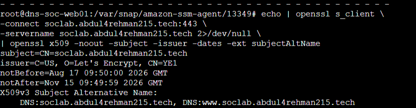

---

## 14. Certificate Renewal Validation

Automatic renewal was tested using Certbot's dry-run mode:

```bash
sudo certbot renew --dry-run
```

The renewal simulation completed successfully.

The certificate renewal timer/service can also be checked with:

```bash
systemctl list-timers | grep -i certbot || true
```

**Evidence**

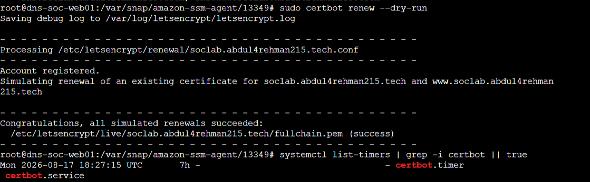

---

## 15. Nginx Access Logging

The site-specific access log is:

```
/var/log/nginx/soclab_access.log
```

A successful HTTPS request was generated:

```bash
curl -sS https://soclab.abdul4rehman215.tech/ -o /dev/null
```

The log was then checked:

```bash
sudo tail -n 10 /var/log/nginx/soclab_access.log
```

The successful request was recorded with HTTP status 200.

**Evidence**

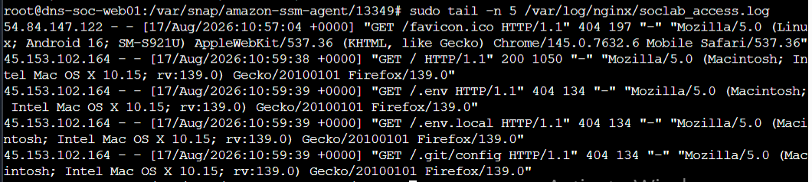

---

## 16. Controlled 404 Validation

A harmless non-existent URL was requested:

```bash
curl -sS -o /dev/null \
https://soclab.abdul4rehman215.tech/nonexistent-test-page
```

The access log was checked:

```bash
sudo tail -n 10 /var/log/nginx/soclab_access.log
```

The request was recorded with HTTP status 404.

This validates that both successful and failed web requests are available for future SOC monitoring and Splunk ingestion.

**Evidence**

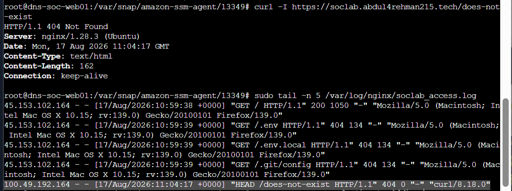

---

## 17. Final Validation

The final web-server validation included:

```bash
sudo nginx -t
sudo systemctl status nginx --no-pager
sudo ss -lntp | grep -E ':80\b|:443\b'
curl -I https://soclab.abdul4rehman215.tech
curl -I http://soclab.abdul4rehman215.tech
sudo certbot certificates
sudo tail -n 5 /var/log/nginx/soclab_access.log
sudo tail -n 5 /var/log/nginx/soclab_error.log
```

**Final State**

The web server successfully provides:

- Public DNS resolution
- Nginx web service
- Custom SOC landing page
- HTTPS
- Let's Encrypt certificate
- HTTP to HTTPS redirect
- Certificate renewal
- Site-specific access logging
- Controlled 404 logging

**Evidence**

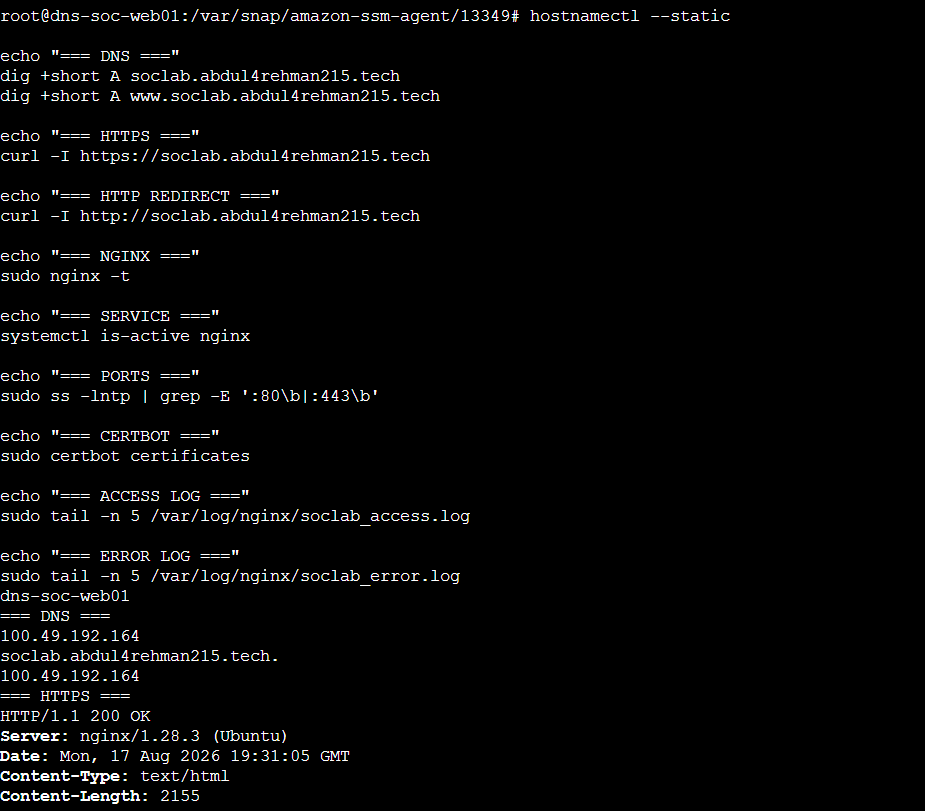
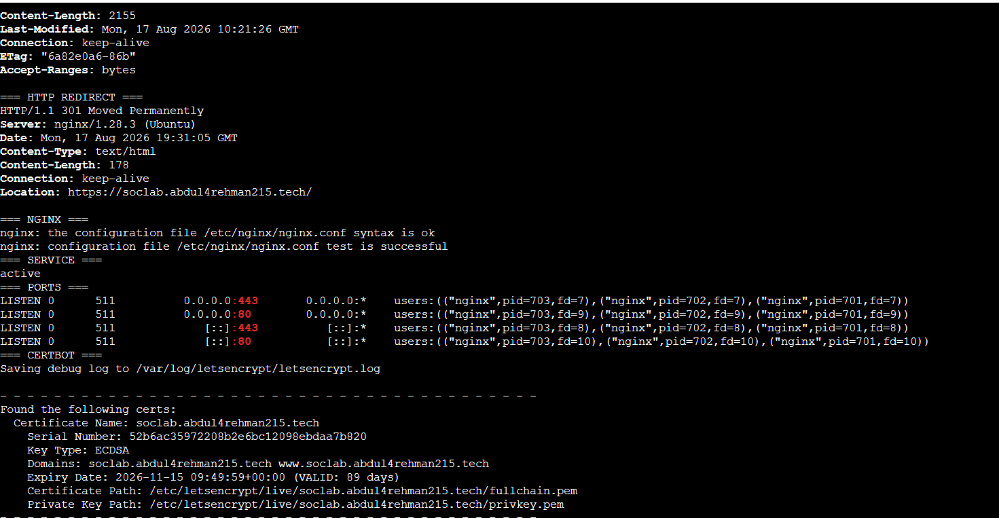
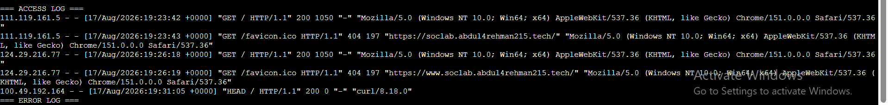


---

## 18. Security Notes

- The web server is intended to be administered through AWS Systems Manager Session Manager rather than public SSH.
- Public web access is limited to:
  - TCP/80
  - TCP/443
- The web server does not publish private keys, credentials, AWS access keys, or Splunk credentials.
- Let's Encrypt private-key material under `/etc/letsencrypt/` must never be committed to GitHub.

---

## 19. Telemetry Handoff - Completed

The web service is complete **and its log-forwarding handoff is now complete**. The Universal Forwarder sends the required Nginx telemetry over the private SOC VPC path to `10.50.20.10:9997`.

```text
dns-soc-web01
    |
    +-- /var/log/nginx/soclab_access.log
    +-- /var/log/nginx/soclab_error.log
    |
    | Splunk Universal Forwarder
    | private TCP 9997
    v
dns-soc-splunk01
    |
    v
index=dns_soc_web
```

The completed Splunk-side onboarding and Gate B evidence are documented in [`../03-splunk-build/05-web-forwarder-onboarding.md`](../03-splunk-build/05-web-forwarder-onboarding.md).

The controlled 200/404 requests used here and during onboarding are **telemetry validation traffic only**. They are not the Scenario 01 DNS reconnaissance exercise.

Authoritative DNS, VPC Flow, CloudTrail and VPC Resolver telemetry are documented separately in [`07-security-telemetry.md`](07-security-telemetry.md) and [`../03-splunk-build/06-aws-telemetry-onboarding.md`](../03-splunk-build/06-aws-telemetry-onboarding.md).
