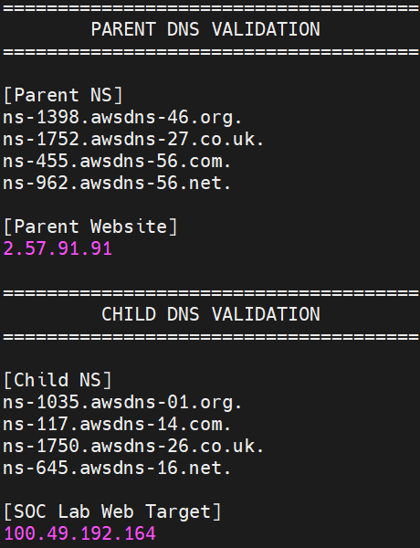

# AWS Build

This folder records what has actually been built in AWS. It is intentionally separate from the architecture folder: the architecture explains the design; this folder proves the implementation.

## Current implementation status

| AWS work | Status |
|---|---|
| IAM user access / admin group / password policy | Complete |
| MFA and account access hardening | Complete |
| Monthly cost budget | Complete |
| EC2 SSM role | Complete |
| `SOC-LAB-VPC` | Complete |
| `ATTACK-LAB-VPC` | Complete |
| Four current subnets | Complete |
| Two Internet Gateways | Complete |
| SOC public/private route tables | Complete |
| Attack public route table | Complete |
| Baseline security groups | Complete |
| Scenario 01 EC2 deployment | Complete |
| Route 53 parent DNS migration | Complete |
| Route 53 child zone / parent-to-child delegation | Complete |
| Public DNS validation | Complete |
| Child `www` CNAME + training TXT fixture | Complete |
| Nginx / HTTPS for main + `www` hostnames | **Next** |
| AWS security/log telemetry | Not built yet |

## Current AWS environment

The Scenario 01 compute layer and the public DNS authority chain are now active. The parent domain stays on its existing website target while `soclab.abdul4rehman215.tech` is delegated to a separate Route 53 child zone. The child zone now has its final static baseline: main A record, Route 53 NS/SOA, the `"DNS SOC Training Lab"` TXT fixture and `www` CNAME. Both web names lead to the same web EC2 Elastic IP.

*The current DNS state keeps `abdul4rehman215.tech` on its parent Route 53 authority and existing website address while the delegated `soclab` child zone resolves to `100.49.192.164`.*

## Documents

- [`01-account-security-and-access.md`](01-account-security-and-access.md)
- [`02-vpc-subnets-and-routing.md`](02-vpc-subnets-and-routing.md)
- [`03-security-groups-and-ssm.md`](03-security-groups-and-ssm.md)
- [`04-ec2-deployment.md`](04-ec2-deployment.md)
- [`05-route53-and-domain.md`](05-route53-and-domain.md)
- [`screenshots/`](screenshots/) - implementation evidence captured from the AWS console and validation sessions

New build files are added only when that AWS component is actually implemented.
