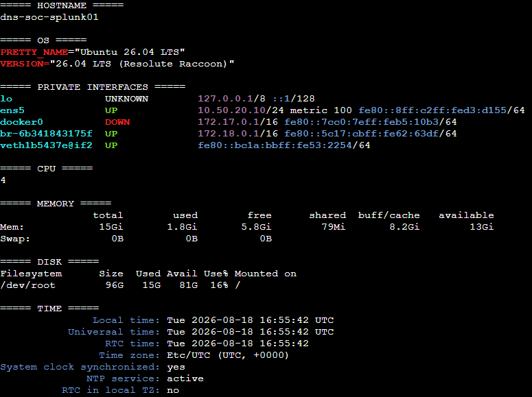

# Splunk Platform Deployment

## Objective

Deploy a durable single-instance Splunk Enterprise platform for the DNS SOC lab on `dns-soc-splunk01` without exposing unnecessary management services to the Internet.

This is a learning/lab deployment rather than an enterprise cluster. The design prioritizes reproducibility, controlled access, persistence and clean data onboarding.

## Host baseline

| Setting | Value |
|---|---|
| EC2 instance | `dns-soc-splunk01` |
| Private IP | `10.50.20.10` |
| Subnet | `SOC-SIEM-SUBNET` |
| OS | Ubuntu 26.04 LTS |
| CPU | 4 vCPU |
| Memory | ~16 GiB |
| EBS | 100 GiB |
| Administration | AWS Systems Manager Session Manager |

The host preflight verified hostname, OS, private addressing, CPU, memory, disk capacity and time synchronization before the final Splunk container was accepted.



## Docker and Compose

Docker Engine and the Compose plugin were validated before the final deployment. The Docker root remains on the EC2 root EBS volume under `/var/lib/docker`, so Splunk data growth, Docker images and host disk usage are reviewed together.


The repository-safe Compose definition is kept in [`configs/compose.yaml`](configs/compose.yaml). The deployment uses:

```text
image              splunk/splunk:10.4.2
container          dns-soc-splunk
hostname           dns-soc-splunk01
restart policy     unless-stopped
Web                10.50.20.10:8000 -> 8000
UF receiver         10.50.20.10:9997 -> 9997
persistent config  dns-soc-splunk-etc -> /opt/splunk/etc
persistent data    dns-soc-splunk-var -> /opt/splunk/var
Docker network     dns-soc-internal
```

The real admin password is kept outside the repository in `/etc/dns-soc-splunk/splunk.env` with root-only permissions. Only [`configs/splunk.env.example`](configs/splunk.env.example) is tracked.


## Network exposure

The host publishes only the two ports needed for the current phase:

| Port | Purpose | Exposure model |
|---|---|---|
| TCP `8000` | Splunk Web | `SG-SPLUNK` from four approved team `/32` public addresses |
| TCP `9997` | Universal Forwarder receiver | `SG-SPLUNK` from `SG-WEB` for the current Web Forwarder phase |
| TCP `8088` | HEC | Not host-published; deferred to shared AI integration |
| TCP `8089` | Splunk management | Not host-published |
| TCP `22` | SSH | No public SG rule; SSM is the management path |

The local Linux host may have `sshd` installed/listening, but the AWS security group does not grant public SSH access.


Splunk Web currently uses the default HTTP service on TCP `8000`, protected by the restricted team-source SG rules. Web TLS can be treated as a later hardening item without changing the current telemetry architecture.

## Startup and health validation

The final Compose service reached a healthy state using the image-provided Splunk health check. The team also validated `splunkd`, the local Web endpoint and host resource availability.


The receiver path was also checked locally before any forwarder was onboarded:

```text
10.50.20.10:9997 -> accepting connections
```


## Final platform result

The platform is accepted as **Gate A complete**. Real log onboarding begins only after this point so collection or parsing problems can be separated from platform/persistence problems.

The next phase is the Universal Forwarder on `dns-soc-web01`; it will use the private SOC VPC path to `10.50.20.10:9997` rather than sending server logs over a public ingestion endpoint.
