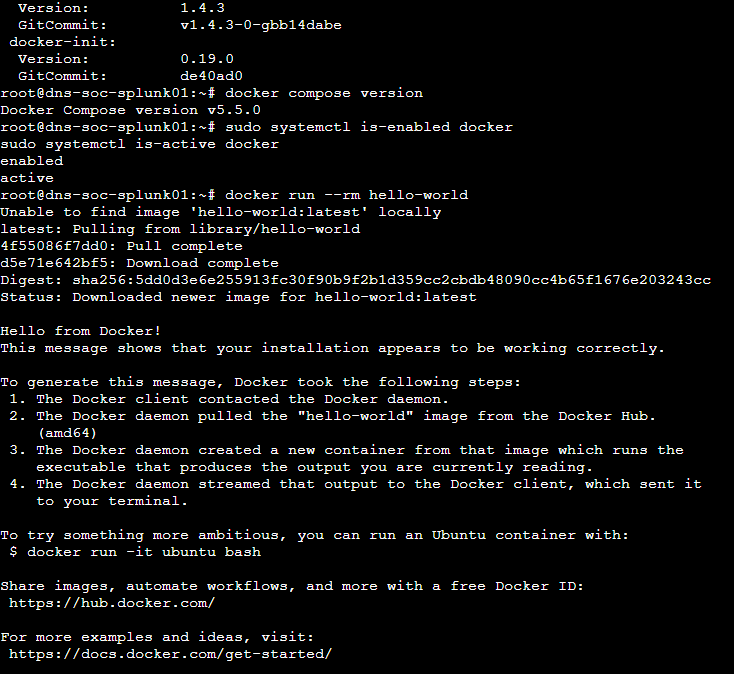
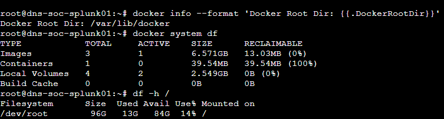
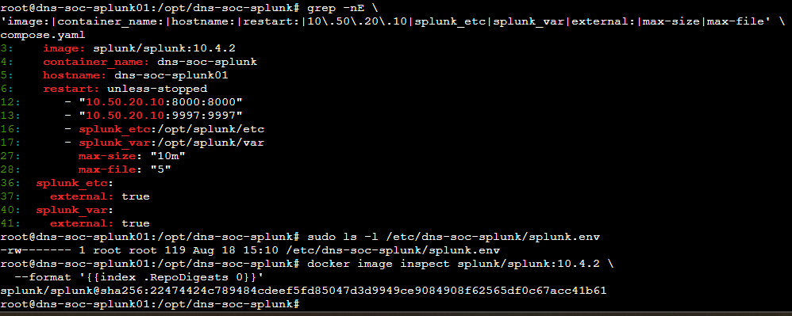
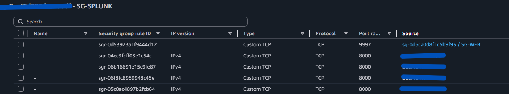
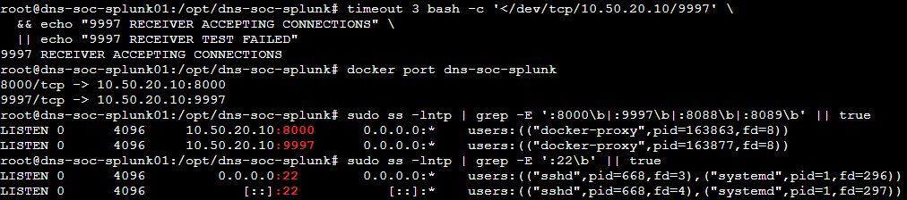
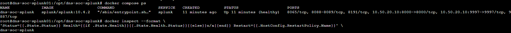
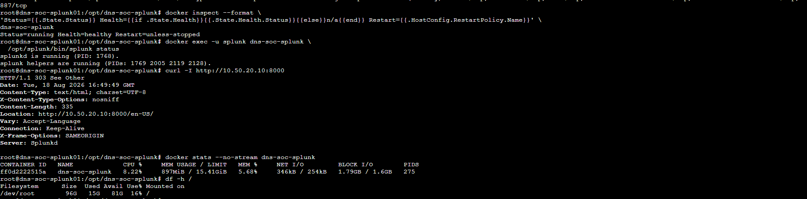
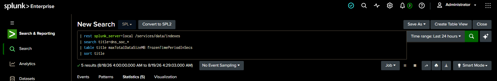
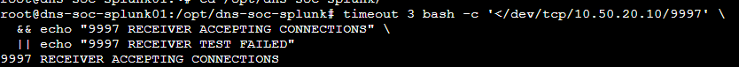

# Splunk Platform Deployment

**Status:** Gate A complete  
**Implementation owner:** [_Sonia_](https://github.com/sonia11mansha415) — Detection Engineer

## Objective

Run a durable single-instance Splunk Enterprise platform for the DNS SOC lab on `dns-soc-splunk01` without exposing unnecessary management services to the Internet.

This is a learning/lab deployment rather than an enterprise cluster. The design prioritizes reproducibility, controlled access, persistence and clean data onboarding.

## Current host baseline

| Setting | Current value |
|---|---|
| EC2 instance | `dns-soc-splunk01` |
| Private IP | `10.50.20.10` |
| Subnet | `SOC-SIEM-SUBNET` |
| OS | **Ubuntu 24.04 LTS** |
| CPU | 4 vCPU |
| Memory | ~16 GiB |
| EBS | 100 GiB |
| Administration | AWS Systems Manager Session Manager |
| Splunk | `10.4.2` |
| KV Store | `ready` / `serverVersion=8.0.26` |

### Rebuild note

The original platform evidence was captured on an Ubuntu 26.04 host. During the later AWS telemetry phase, the Kinesis path exposed an unhealthy legacy KV Store/MongoDB state that was not a good supported foundation for the project. The team rebuilt `dns-soc-splunk01` cleanly on **Ubuntu 24.04 LTS** while keeping the same private IP, instance role, security-group model, storage size and Splunk architecture.

The old host screenshot is preserved only as troubleshooting history:

- [`screenshots/troubleshooting/legacy-55-ubuntu26-host-preflight.png`](screenshots/troubleshooting/legacy-55-ubuntu26-host-preflight.png)

It must not be read as proof of the current OS.

## Docker and Compose

Docker Engine and the Compose plugin were validated before the final deployment. The repository-safe Compose definition is kept in [`configs/compose.yaml`](configs/compose.yaml).

The deployment uses:

```text
image              splunk/splunk:10.4.2
container          dns-soc-splunk
hostname           dns-soc-splunk01
restart policy     unless-stopped
Web                10.50.20.10:8000 -> 8000
UF receiver        10.50.20.10:9997 -> 9997
persistent config  dns-soc-splunk-etc -> /opt/splunk/etc
persistent data    dns-soc-splunk-var -> /opt/splunk/var
Docker network     dns-soc-internal
```

The current Compose project also includes the completed `dns-soc-ai-bridge` service. It shares `dns-soc-internal`, exposes TCP `5000` only inside Docker, and returns AI triage events to Splunk over internal HEC TCP `8088`. The bridge implementation is documented separately in [`../04-ai-integration/`](../04-ai-integration/).

The real Splunk admin password stays outside the repository in `/etc/dns-soc-splunk/splunk.env`, and the AI/API/HEC secrets stay outside Git in `/etc/dns-soc-ai/ai.env`. Only repository-safe examples are tracked.







*These screenshots document the durable Compose design that was retained when the host was rebuilt on Ubuntu 24.04.*

## Network exposure

| Port | Purpose | Exposure model |
|---|---|---|
| TCP `8000` | Splunk Web | `SG-SPLUNK` from approved team public addresses only |
| TCP `9997` | Universal Forwarder receiver | `SG-SPLUNK` from `SG-WEB` |
| TCP `8088` | HEC | Active for the shared AI bridge on the internal Docker path; not host-published |
| TCP `8089` | Splunk management | Not host-published |
| TCP `22` | SSH | No public SG rule; SSM is the administration path |





The Web Universal Forwarder now actively uses the private receiver path on `10.50.20.10:9997`.

## Startup and health

The Compose service was validated for normal startup, Splunk Web access and the TCP `9997` receiver.









The later clean 24.04 rebuild repeated the platform gate and added the important KV Store acceptance check:

```text
status        : ready
serverVersion : 8.0.26
```

## Persistence and recovery

The platform uses named Docker volumes so the container can be replaced without treating the container filesystem as the data store.

```text
dns-soc-splunk-etc -> /opt/splunk/etc
dns-soc-splunk-var -> /opt/splunk/var
```

The project also validated:

- normal Compose restart;
- Docker daemon restart recovery;
- forced container recreation while keeping named volumes;
- backup archives for both named volumes.

The operational details are in [`03-backup-recovery-and-operations.md`](03-backup-recovery-and-operations.md).

## Gate A result

Gate A is complete because the current platform provides:

```text
supported host OS
+ pinned Splunk version
+ healthy KV Store
+ persistent volumes
+ restricted Web access
+ private UF receiver
+ project indexes
+ restart / recreate / backup path
```

Gate B and Gate C are now also complete; see [`05-web-forwarder-onboarding.md`](05-web-forwarder-onboarding.md) and [`06-aws-telemetry-onboarding.md`](06-aws-telemetry-onboarding.md).
