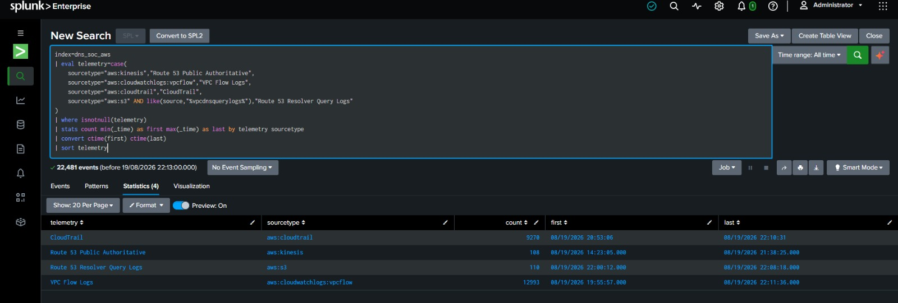

# Splunk Data Structure & Validation

## Design rule

Project telemetry is separated by purpose before ingestion starts. The lab does not use `main` as a catch-all project index.

A source is not considered onboarded only because events are visible. Each onboarding step checks:

```text
index
host
source
sourcetype
timestamp
useful investigation fields
```

## Project indexes

| Index | Purpose | Max size | Retention | Current use |
|---|---|---:|---:|---|
| `dns_soc_web` | Nginx access/error telemetry | 5 GiB | 30 days | Active / Gate B |
| `dns_soc_linux` | Selected Linux security/system telemetry | 5 GiB | 30 days | Reserved until a real source is explicitly onboarded |
| `dns_soc_aws` | Route 53, VPC Flow Logs, CloudTrail and AWS VPC Resolver telemetry | 15 GiB | 30 days | Active / Gate C |
| `dns_soc_dns` | Team-controlled resolver DNS data | 10 GiB | 30 days | Scenario 02 onward |
| `dns_soc_ai` | AI triage/enrichment returned to Splunk | 5 GiB | 30 days | **Active / shared AI foundation** |

All five indexes were validated with:

```spl
| rest splunk_server=local /services/data/indexes
| search title=dns_soc_*
| table title maxTotalDataSizeMB frozenTimePeriodInSecs
| sort title
```

The final retention value is:

```text
frozenTimePeriodInSecs = 2592000
```


## Gate B — Web telemetry

The Web Universal Forwarder sends only required Nginx sources to the private receiver on `10.50.20.10:9997`.

| Data | Index | Sourcetype | Host | Source |
|---|---|---|---|---|
| Nginx access | `dns_soc_web` | `dns_soc:nginx:access` | `dns-soc-web01` | `/var/log/nginx/soclab_access.log` |
| Nginx error | `dns_soc_web` | `dns_soc:nginx:error` when real error events are collected | `dns-soc-web01` | `/var/log/nginx/soclab_error.log` |
| Linux security/system | `dns_soc_linux` | Not claimed until a real source is enabled | `dns-soc-web01` | Real file/journal source only |

The Gate B record clearly proves the Nginx access source. The project does **not** create a fake `/var/log/auth.log` merely to populate `dns_soc_linux`.

Useful Web checks are preserved in [`validation/validation-searches.spl`](validation/validation-searches.spl).

Gate B is documented in detail in [`05-web-forwarder-onboarding.md`](05-web-forwarder-onboarding.md).

## Gate C — AWS telemetry

AWS data is collected through the Splunk Add-on for AWS `8.2.1` and lands in `dns_soc_aws`.

The project records the **real sourcetypes produced by the running inputs**:

| Telemetry family | Splunk input | Input type | Actual sourcetype |
|---|---|---|---|
| Route 53 public authoritative query logs | `route53-public-query-logs` | Kinesis | `aws:kinesis` |
| VPC Flow Logs | `vpc-flow-logs` | SQS-Based S3 / VPC Flow Logs decoder | `aws:cloudwatchlogs:vpcflow` |
| CloudTrail | `cloudtrail-logs` | SQS-Based S3 / CloudTrail decoder | `aws:cloudtrail` |
| Route 53 Resolver Query Logs | `resolver-query-logs` | SQS-Based S3 / Custom Data Type | `aws:s3` |


### Route 53 public authoritative logs

Observed placement:

```text
index      = dns_soc_aws
sourcetype = aws:kinesis
host       = dns-soc-splunk01
source     = CloudWatch / Route 53 stream identity
```

The raw events were validated for:

- queried name;
- query type;
- result context such as `NOERROR` / `NXDOMAIN` when generated;
- event time;
- protocol;
- AWS/source context actually present.

This dataset records queries reaching the public authoritative hosted zone.

### VPC Flow Logs

Observed placement:

```text
index      = dns_soc_aws
sourcetype = aws:cloudwatchlogs:vpcflow
host       = $decideOnStartup
source     = s3://.../vpc-flow/AWSLogs/.../vpcflowlogs/...
```

Both `SOC-LAB-VPC` and `ATTACK-LAB-VPC` were proven in the indexed data.

Useful normalized fields observed from real events include:

```text
src / src_ip
dest / dest_ip
src_port
dest_port
protocol
action
vpcflow_action
packets
bytes
start_time
end_time
```

`action` is Splunk-normalized (`allowed` / `blocked`) while `vpcflow_action` preserves AWS-style `ACCEPT` / `REJECT` context.

### CloudTrail

Observed placement:

```text
index      = dns_soc_aws
sourcetype = aws:cloudtrail
host       = $decideOnStartup
source     = s3://.../cloudtrail/AWSLogs/.../CloudTrail/...
```

Useful fields validated from real events:

```text
eventName
eventSource
sourceIPAddress
userIdentity.type
userIdentity.arn
awsRegion
errorCode / result context
errorMessage when present
```

Because the trail is multi-region, events can legitimately contain regions other than `us-east-1`.

### Route 53 Resolver Query Logs

Observed placement:

```text
index      = dns_soc_aws
sourcetype = aws:s3
host       = $decideOnStartup
source     = s3://.../AWSLogs/.../vpcdnsquerylogs/<vpc-id>/...
```

The input uses the Custom Data Type decoder, so JSON fields are exposed with `spath` rather than pretending the add-on produced a dedicated Resolver sourcetype.

Useful fields validated from real events:

```text
query_timestamp
vpc_id
srcaddr
srcids.instance
query_name
query_type
rcode
answers / answer data when AWS returns it
region
```

This AWS-managed Resolver dataset stays in `dns_soc_aws`. The separate index `dns_soc_dns` is reserved for the future **team-controlled BIND/Unbound resolver** introduced from Scenario 02 onward.

## Gate C completion search

The final combined validation classified all four active AWS families:

```spl
index=dns_soc_aws
| eval telemetry=case(
    sourcetype="aws:kinesis","Route 53 Public Authoritative",
    sourcetype="aws:cloudwatchlogs:vpcflow","VPC Flow Logs",
    sourcetype="aws:cloudtrail","CloudTrail",
    sourcetype="aws:s3" AND like(source,"%vpcdnsquerylogs%"),"Route 53 Resolver Query Logs"
)
| where isnotnull(telemetry)
| stats count min(_time) as first max(_time) as last by telemetry sourcetype
| convert ctime(first) ctime(last)
| sort telemetry
```



*All four AWS telemetry families have real events in `dns_soc_aws` with their actual sourcetypes and usable timestamps.*

## Shared AI data boundary

The completed shared AI bridge returns enrichment to:

```text
index=dns_soc_ai
sourcetype=dns_soc:ai:triage
source=dns-soc-ai-bridge
```

The bridge receives Splunk alert evidence through an internal webhook, calls the OpenAI API for schema-controlled analyst context, and returns the result through internal HTTPS HEC. AI output is supporting context only. Raw Web, DNS, flow and cloud events remain the evidence source used by the SOC Analyst.

Implementation and validation are documented in [`../04-ai-integration/`](../04-ai-integration/).
