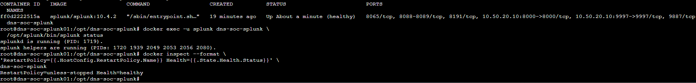
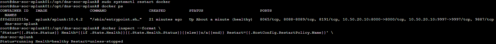
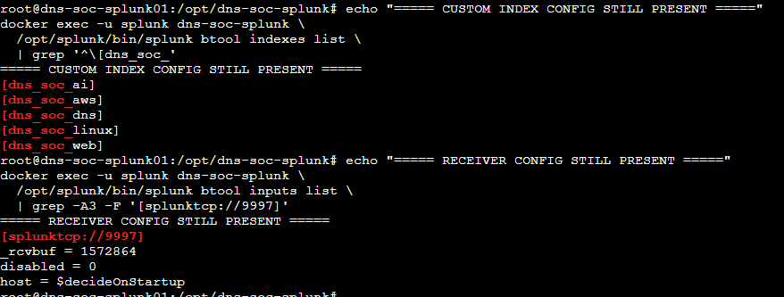
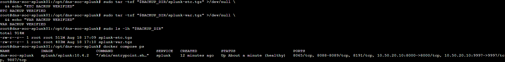

<!-- dns-soc-nav:start -->
[🏠 Repository Home](../README.md) · [📁 03 Splunk Build](README.md)
<!-- dns-soc-nav:end -->


# Splunk Backup, Recovery & Operations

## Persistence model

The container is replaceable; the Splunk state is not.

```text
dns-soc-splunk
    |
    +-- /opt/splunk/etc -> dns-soc-splunk-etc
    |
    +-- /opt/splunk/var -> dns-soc-splunk-var
```

Both named volumes are external to the Compose service definition so normal container recreation does not delete them.


## Current host rebuild and recovery model

The later move from the first Ubuntu 26.04 host to the current **Ubuntu 24.04 LTS** host did not change the intended Splunk persistence model. The rebuilt environment returned to the same pinned image, named-volume layout, restricted port model and project indexes before AWS telemetry was trusted again.

The rebuild is documented as an implementation correction in [`04-troubleshooting-and-lessons.md`](04-troubleshooting-and-lessons.md).

## Shared AI bridge operational state

The same Compose project now also runs `dns-soc-ai-bridge`. Unlike Splunk state, the bridge application is normal source code and can be rebuilt from [`../04-ai-integration/bridge/`](../04-ai-integration/bridge/).

Runtime secrets remain outside Git at `/etc/dns-soc-ai/ai.env`. Keep the real OpenAI service-account key and HEC token in the team's approved secret store/recovery process rather than copying them into repository backups.

A bridge-only rebuild is non-destructive to Splunk state:

```bash
cd /opt/dns-soc-splunk
docker compose up -d --build ai-bridge
```

## Routine health checks

From `/opt/dns-soc-splunk`:

```bash
docker compose ps

docker inspect --format \
'Status={{.State.Status}} Health={{if .State.Health}}{{.State.Health.Status}}{{else}}n/a{{end}} Restart={{.HostConfig.RestartPolicy.Name}}' \
dns-soc-splunk

docker inspect --format \
'Status={{.State.Status}} Health={{if .State.Health}}{{.State.Health.Status}}{{else}}n/a{{end}} Restart={{.HostConfig.RestartPolicy.Name}}' \
dns-soc-ai-bridge

docker exec -u splunk dns-soc-splunk \
  /opt/splunk/bin/splunk status

docker system df
df -h /
```

The expected steady state is `running`, `healthy` and `Restart=unless-stopped`.

## Normal restart validation

A normal Compose restart was tested and Splunk returned healthy with its receiver/configuration intact.

```bash
docker compose restart splunk
```



The Docker service itself was also restarted to prove the container returns automatically through the restart policy.



## Container recreation test

The stronger persistence test recreates the container while keeping the named volumes:

```bash
docker compose up -d --force-recreate
```

After recreation, the team verified the five custom index stanzas and the TCP `9997` receiver configuration were still present.



This test is the main proof that the Splunk configuration/data lifecycle is separated from the container lifecycle.

## Baseline backup

Backups are stored outside the repository under a timestamped host path such as:

```text
/var/backups/dns-soc-splunk/YYYY-MM-DD-HHMM/
```

A consistent point-in-time backup stops Splunk briefly, archives both named volumes and then starts the service again.

```bash
BACKUP_DIR=/var/backups/dns-soc-splunk/$(date +%F-%H%M)
sudo mkdir -p "$BACKUP_DIR"

docker compose stop splunk

docker run --rm \
  -v dns-soc-splunk-etc:/volume:ro \
  -v "$BACKUP_DIR":/backup \
  alpine:3 \
  sh -c 'tar czf /backup/splunk-etc.tgz -C /volume .'

docker run --rm \
  -v dns-soc-splunk-var:/volume:ro \
  -v "$BACKUP_DIR":/backup \
  alpine:3 \
  sh -c 'tar czf /backup/splunk-var.tgz -C /volume .'

docker compose start splunk
```

Archive integrity is checked without extracting:

```bash
sudo tar -tzf "$BACKUP_DIR/splunk-etc.tgz" >/dev/null && echo "ETC BACKUP VERIFIED"
sudo tar -tzf "$BACKUP_DIR/splunk-var.tgz" >/dev/null && echo "VAR BACKUP VERIFIED"
```



The `.tgz` files are operational backups and are **not** committed to GitHub.

## Update strategy

Before a Splunk image update:

1. record the currently running image/tag;
2. verify the latest volume backup and, for a significant upgrade, take an EBS snapshot;
3. review the target Splunk version before changing the pinned image;
4. update the explicit image tag in `compose.yaml`;
5. pull the target image and recreate the service;
6. validate health, Splunk Web, indexes, TCP `9997`, searches and recent data;
7. keep the previous recovery point until the new version is proven stable.

The repository intentionally avoids `latest` for the final platform definition.

## Rollback principle

Do not treat a Splunk downgrade as simply switching an image tag after a major upgrade. Persistent Splunk data/configuration may have changed. The safe rollback point is the pre-change named-volume backup or EBS snapshot.

## Commands to avoid during routine troubleshooting

Do not use destructive cleanup commands against the live project without a verified recovery plan:

```text
docker compose down -v
docker volume prune
docker volume rm dns-soc-splunk-etc
docker volume rm dns-soc-splunk-var
rm -rf /var/lib/docker
```

Routine troubleshooting should inspect health, logs, disk and configuration first rather than deleting persistent state.


<!-- dns-soc-footer:start -->
<div align="center">

[🏠 Repository Home](../README.md) · [📁 03 Splunk Build](README.md)

<sub>DNSentinel Lab · Controlled DNS security training documentation</sub>

</div>
<!-- dns-soc-footer:end -->
