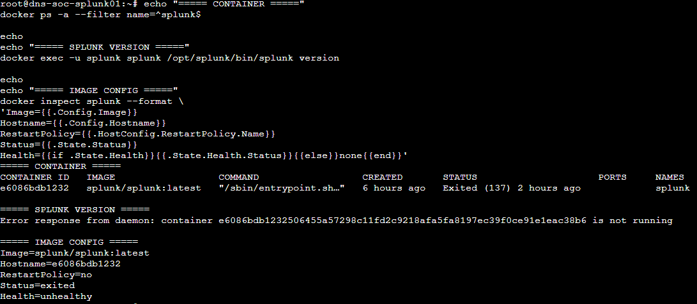
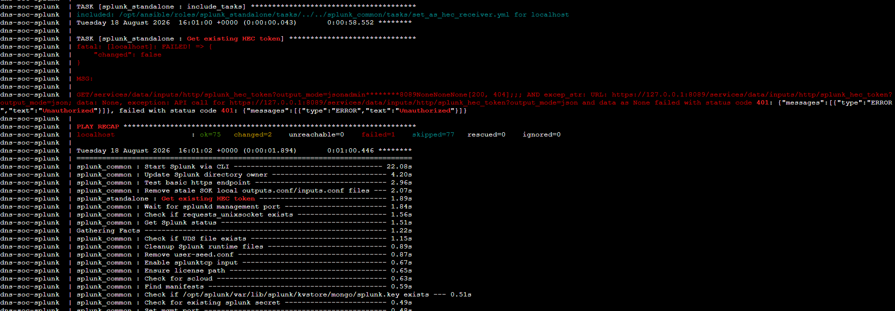

# Splunk Troubleshooting & Lessons

The final platform is stable, but the build included several useful engineering corrections. This file records only the lessons that help explain the final architecture; raw trial-and-error output is not treated as final evidence.

## 1. Initial one-off container was not durable enough

**Observed state**

The first working Splunk container used `splunk/splunk:latest`, a default `RestartPolicy=no` and Docker-created anonymous volumes. Splunk itself worked, but the deployment was not reproducible or reliable across host/container lifecycle events.



**Correction**

The final build moved to:

```text
pinned image: splunk/splunk:10.4.2
Docker Compose
restart: unless-stopped
named external volumes
private host bindings for 8000 / 9997
repository-safe config files
```

**Lesson**

A successful `docker run` is not the same as a durable SIEM platform. Persistence, restart behavior, version pinning and recovery need to be designed before real telemetry is trusted to the system.

## 2. Host restart exposed the missing restart policy

After an EC2 stop/start cycle, Docker returned but the original Splunk container remained stopped because its restart policy was `no`. Splunk Web therefore had no listener on TCP `8000`.

The final `unless-stopped` policy was validated with both a normal Compose restart and a Docker daemon restart. The service now returns healthy without rebuilding the container manually.

## 3. Splunk CLI checks require the correct container user

Early CLI checks produced permission warnings around Splunk runtime/PID files when run under the wrong container identity.

The reliable health command is:

```bash
docker exec -u splunk dns-soc-splunk \
  /opt/splunk/bin/splunk status
```

**Lesson**

A permission warning from an administrative shell command is not automatically evidence that Splunk data is corrupt. Re-run the check using the account expected by the containerized application before escalating the issue.

## 4. Provisioning restart loop / internal HEC API `401`

During final Compose provisioning, Splunk itself started but the container repeatedly exited when the image's provisioning workflow reached an internal HEC API check and received HTTP `401 Unauthorized`.



The team stopped the restart loop, preserved both named volumes, kept the existing backups, and reconciled the protected container bootstrap/admin credential with Splunk's stored admin state. The final environment uses declarative admin-password management in the protected environment file so later container provisioning remains consistent.

HEC is still **not host-published** in Gate A. Its future use belongs to the shared AI integration phase.

**Lesson**

When a container repeatedly restarts, identify the exact failing task before deleting data or rebuilding from scratch. In this case Splunk had already reached its management service; the failure was an authenticated provisioning step rather than a disk, RAM, Docker-network or Splunk-binary failure.

## 5. Receiver exposure was tightened before final acceptance

TCP `9997` is a forwarder receiver, not a public service. A temporary broad receiver rule was replaced before Gate A with an SG-to-SG source restriction:

```text
SG-WEB -> SG-SPLUNK TCP 9997
```

Splunk Web TCP `8000` remains limited to the four approved team source addresses.

**Lesson**

A listener should not be considered secure only because the application is healthy. Application configuration, Docker port publishing and AWS security-group controls all need to agree.

## 6. Index retention was verified explicitly

The project indexes were created before log onboarding. Their storage caps were correct, but the retention value initially reflected a longer default. Before Gate A was closed, all five project indexes were set to the intended 30-day lab retention:

```text
frozenTimePeriodInSecs = 2592000
```

The final index evidence in [`02-data-structure-and-validation.md`](02-data-structure-and-validation.md) shows the corrected value.

**Lesson**

Index creation is not finished when the names appear in Splunk. Storage size and retention should be validated explicitly before production-like data arrives.

## Final outcome

The troubleshooting did not change the project architecture. It improved the implementation until it matched the intended design:

```text
working container
    -> reproducible Compose service
    -> named persistence
    -> controlled network exposure
    -> stable restart behavior
    -> validated indexes / retention
    -> verified backup / recreate path
```

Only the concise evidence above is kept in the public repository. Historical screenshots containing credentials, personal browser details or repetitive intermediate checks remain outside the public evidence set.
