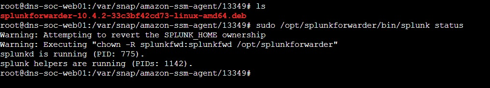
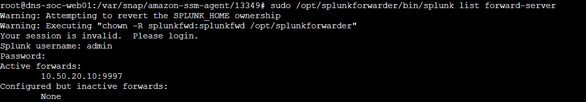
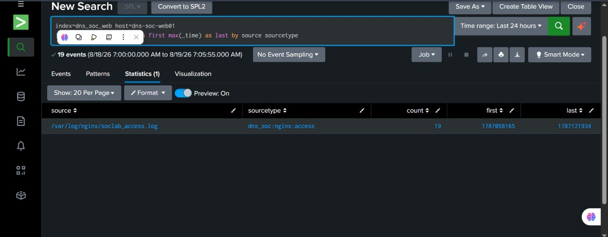
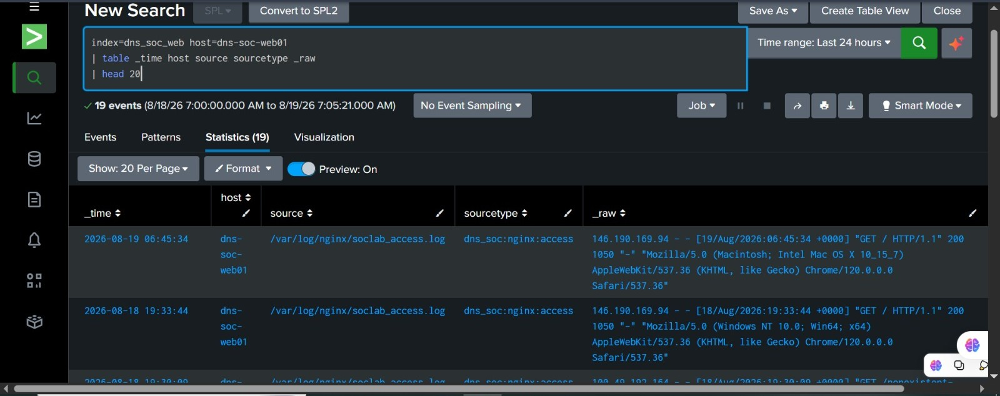

# Web Universal Forwarder Onboarding

**Status:** Gate B complete  
**Implementation / validation owner:** [_Sonia_](https://github.com/sonia11mansha415) — Detection Engineer  
**Source host:** `dns-soc-web01`  
**Splunk receiver:** `10.50.20.10:9997`

## Objective

Bring the real Nginx telemetry from `dns-soc-web01` into Splunk through the private SOC VPC path and prove that the data is useful before Scenario 01 detection work begins.

The web server itself was built and validated earlier in [`../02-aws-build/06-nginx-https-web-server.md`](../02-aws-build/06-nginx-https-web-server.md).

## Final collection path

```text
dns-soc-web01
10.50.10.10
    |
    | Splunk Universal Forwarder 10.4.2
    | private TCP 9997
    v
dns-soc-splunk01
10.50.20.10
    |
    v
index=dns_soc_web
```

No public ingestion endpoint is needed for this path. `SG-SPLUNK` allows TCP `9997` from `SG-WEB`, and the two EC2 instances communicate through the local `SOC-LAB-VPC` route.

## Universal Forwarder installation

The Splunk Universal Forwarder was installed on `dns-soc-web01` and enabled to run as a service.



*The service status confirms the Universal Forwarder is installed and running on the Web EC2 instance.*

## Forwarding destination

The forwarder was pointed at the private Splunk receiver:

```text
10.50.20.10:9997
```



*The forward-server check shows the Splunk receiver as the active destination.*

The repository-safe output configuration is kept in [`forwarders/dns-soc-web01/outputs.conf`](forwarders/dns-soc-web01/outputs.conf).

## Monitored sources

The forwarder is intentionally narrow. It does not monitor all of `/var/log`.

The required Nginx sources are:

```text
/var/log/nginx/soclab_access.log
/var/log/nginx/soclab_error.log
```

The repository-safe monitor configuration is kept in [`forwarders/dns-soc-web01/inputs.conf`](forwarders/dns-soc-web01/inputs.conf).

Current identities:

| Data | Index | Sourcetype | Host |
|---|---|---|---|
| Nginx access | `dns_soc_web` | `dns_soc:nginx:access` | `dns-soc-web01` |
| Nginx error | `dns_soc_web` | `dns_soc:nginx:error` when real error events are present | `dns-soc-web01` |

A Linux security/system source is **not claimed** in this repository unless a real file or journal input is explicitly enabled and validated. The project does not create a fake `/var/log/auth.log` to satisfy a planned path.

## Controlled telemetry generation

Fresh Web requests were generated to prove the ingestion path, including successful requests and a controlled nonexistent page.

This traffic is **onboarding validation only**. It is not the Scenario 01 DNS reconnaissance simulation.

The purpose was simple:

```text
request happens now
    -> Nginx writes it
    -> Universal Forwarder reads it
    -> Splunk receives it
    -> _time / host / source / sourcetype can be checked
```

## Splunk data-quality validation

The useful checks were:

```spl
index=dns_soc_web host=dns-soc-web01
| stats count by source sourcetype
```

```spl
index=dns_soc_web host=dns-soc-web01
| table _time host source sourcetype _raw
| head 20
```

```spl
index=dns_soc_web host=dns-soc-web01
| stats count min(_time) as first max(_time) as last by source sourcetype
```

### Source / sourcetype summary



*The summary proves that Nginx events are landing in the intended `dns_soc_web` index with the project sourcetype.*

### Real Nginx event evidence



*The raw-event view shows real Nginx access telemetry with `_time`, `host=dns-soc-web01`, the source file and `dns_soc:nginx:access`.*

## Gate B result

Gate B is complete for the Web telemetry required by the current project stage:

| Check | Result |
|---|---|
| Universal Forwarder installed and running | Passed |
| Private receiver target `10.50.20.10:9997` | Passed |
| Required Nginx source onboarded | Passed |
| `index=dns_soc_web` | Passed |
| `host=dns-soc-web01` | Passed |
| Real source path | Passed |
| Real sourcetype | Passed |
| Event time / raw request visible | Passed |

A separate Linux security source has not been independently validated in the current build record, so `54-linux-logs-in-splunk.png` is intentionally **not claimed**.

## Why this matters for Scenario 01

The later investigation can correlate:

```text
DNS reconnaissance
        +
public Route 53 evidence
        +
HTTPS follow-up
        +
Nginx request path / status
        +
VPC network flow
```

That gives the SOC Analyst a stronger story than a DNS alert by itself.

## Evidence index

- [`51-splunk-uf-installed.png`](screenshots/web-forwarder/51-splunk-uf-installed.png)
- [`52-web-forwarder-target.png`](screenshots/web-forwarder/52-web-forwarder-target.png)
- [`53-nginx-logs-in-splunk.png`](screenshots/web-forwarder/53-nginx-logs-in-splunk.png)
- [`nginx-source-summary.png`](screenshots/web-forwarder/nginx-source-summary.png)
