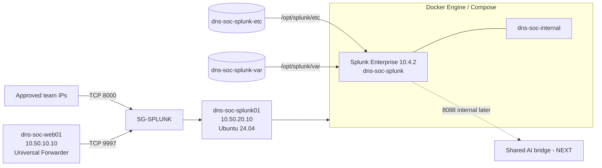
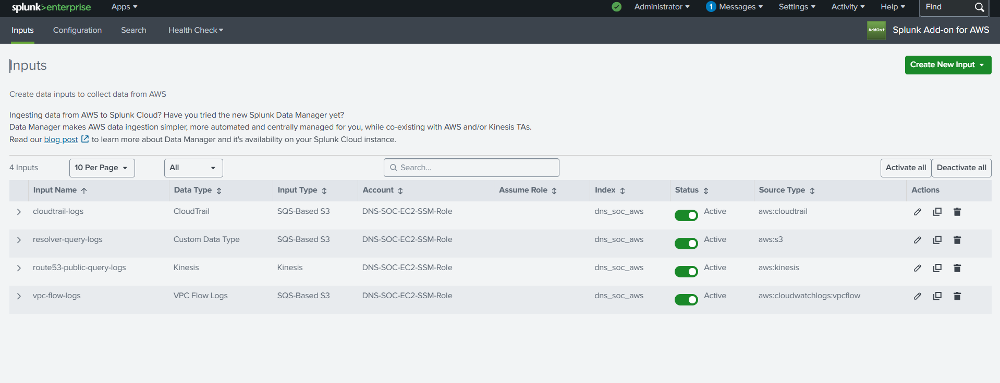

# Splunk Build

**Status:** Gates A, B and C complete — shared telemetry is trusted.  
**Splunk implementation / validation owner:** [_Sonia_](https://github.com/sonia11mansha415) — Detection Engineer

This folder records the deployed Splunk Enterprise platform on `dns-soc-splunk01`, the Web Universal Forwarder path and the AWS telemetry onboarding used by the shared DNS SOC infrastructure.

Scenario-specific dashboards, detections, tuning, attack ground truth and IR evidence stay in the separate scenario repositories.

## Current platform

| Item | Implemented state |
|---|---|
| EC2 host | `dns-soc-splunk01` — `10.50.20.10` |
| Current host OS | **Ubuntu 24.04 LTS** |
| Host resources | 4 vCPU, ~16 GiB RAM, 100 GiB EBS |
| Container runtime | Docker Engine + Docker Compose |
| Splunk image | `splunk/splunk:10.4.2` |
| Container | `dns-soc-splunk` |
| Restart policy | `unless-stopped` |
| KV Store | `status=ready`, `serverVersion=8.0.26` |
| Splunk Web | TCP `8000`, host-bound to `10.50.20.10`, SG access restricted to approved team sources |
| Universal Forwarder receiver | TCP `9997`, host-bound to `10.50.20.10`, source restricted to `SG-WEB` |
| Splunk Add-on for AWS | `8.2.1` |
| AWS authentication | EC2 IAM role `DNS-SOC-EC2-SSM-Role`, autodiscovered by the add-on |
| HEC `8088` | Not host-published; reserved for the shared AI integration |
| Management `8089` | Not host-published |
| Public SSH | No SG rule; EC2 administration uses SSM |
| Config persistence | `dns-soc-splunk-etc` -> `/opt/splunk/etc` |
| Data/runtime persistence | `dns-soc-splunk-var` -> `/opt/splunk/var` |
| Backup | Verified compressed backups of both named volumes |

## Important host rebuild note

The first Splunk host was built on Ubuntu 26.04 and passed the original platform checks, but the later AWS/Kinesis work exposed an unhealthy legacy KV Store/MongoDB compatibility state. The team chose a **clean rebuild on Ubuntu 24.04 LTS** rather than forcing an unsupported database path.

The current deployed source of truth is therefore:

```text
dns-soc-splunk01
Ubuntu 24.04 LTS
10.50.20.10
Splunk Enterprise 10.4.2
KV Store ready / 8.0.26
```

The old Ubuntu 26.04 host screenshot is kept only in [`screenshots/troubleshooting/`](screenshots/troubleshooting/) as historical evidence. It is not presented as current-state proof.

## Platform architecture



## Project indexes

| Index | Intended data | Max size | Retention | Current state |
|---|---|---:|---:|---|
| `dns_soc_web` | Nginx access/error telemetry | 5 GiB | 30 days | **Active / validated** |
| `dns_soc_linux` | Selected Linux security/system telemetry | 5 GiB | 30 days | Reserved; only use a real source when implemented |
| `dns_soc_aws` | Route 53, VPC Flow Logs, CloudTrail and AWS Resolver Query Logs | 15 GiB | 30 days | **Active / validated** |
| `dns_soc_dns` | Team-controlled resolver DNS telemetry | 10 GiB | 30 days | Scenario 02 onward |
| `dns_soc_ai` | AI triage/enrichment returned to Splunk | 5 GiB | 30 days | Next shared AI phase |

All five indexes were validated with `frozenTimePeriodInSecs=2592000`.


## Gate A — Splunk platform complete

Gate A proves the SIEM itself is stable before trusting real telemetry:

- Docker and Compose are working;
- the pinned Splunk container starts cleanly;
- named volumes preserve configuration and indexed data;
- Splunk Web is reachable through the restricted SG path;
- TCP `9997` is enabled for Universal Forwarders;
- unnecessary host exposure on `8088` and `8089` is avoided;
- custom indexes and 30-day retention are configured;
- restart, recreation and backup behavior are documented.

See [`01-platform-deployment.md`](01-platform-deployment.md).

## Gate B — Web telemetry complete

`dns-soc-web01` now sends controlled Nginx telemetry over the private SOC VPC path:

```text
dns-soc-web01
    |
    | Splunk Universal Forwarder
    | TCP 9997
    v
dns-soc-splunk01
    |
    v
index=dns_soc_web
```

The team validated real request time, host, source, sourcetype and raw Nginx events. See [`05-web-forwarder-onboarding.md`](05-web-forwarder-onboarding.md).

## Gate C — AWS telemetry complete

The Splunk Add-on for AWS `8.2.1` now has four active inputs:

| Input | Input type | Actual sourcetype | Index |
|---|---|---|---|
| `route53-public-query-logs` | Kinesis | `aws:kinesis` | `dns_soc_aws` |
| `vpc-flow-logs` | SQS-Based S3 | `aws:cloudwatchlogs:vpcflow` | `dns_soc_aws` |
| `cloudtrail-logs` | SQS-Based S3 | `aws:cloudtrail` | `dns_soc_aws` |
| `resolver-query-logs` | SQS-Based S3 / Custom Data Type | `aws:s3` | `dns_soc_aws` |



*The input view proves all four collectors are active and records the real sourcetypes used by the running add-on.*

See [`06-aws-telemetry-onboarding.md`](06-aws-telemetry-onboarding.md).

## Later scenario data onboarding

The current Splunk platform should also be reused rather than rebuilt. Future scenario additions are small and source-specific:

| Scenario | Splunk-side addition later | Destination |
|---|---|---|
| **01** | Scenario dashboard, SPL and alert logic only | Scenario 01 repository |
| **02** | Onboard the team-controlled resolver logs after `dns-soc-resolver01` exists | `index=dns_soc_dns` with the real sourcetype chosen from the implemented resolver/log format |
| **03** | Reuse resolver telemetry and correlate with VPC Flow / DNS answer churn | Existing indexes unless a real new source requires otherwise |
| **04** | Reuse resolver/client telemetry and validate tunneling-specific fields | Existing indexes unless a real new source requires otherwise |

Do not invent a BIND/Unbound sourcetype now. The final resolver input and field extraction are documented only after Scenario 02 implements and validates the real DNS service.

Scenario dashboards and detections remain outside this folder. The shared scenario standard is [`../00-project-design/scenario-documentation-standard.md`](../00-project-design/scenario-documentation-standard.md).

## Current next step

The shared telemetry foundation is finished. The next infrastructure phase is:

```text
Splunk alert payload
        |
        v
shared Flask / LLM bridge
        |
        v
LLM API
        |
        v
structured enrichment
        |
        v
Splunk HEC (internal path)
        |
        v
index=dns_soc_ai
```

That work belongs in [`../04-ai-integration/`](../04-ai-integration/). After the shared AI foundation is validated, Scenario 01 detection engineering continues in the dedicated Scenario 01 repository.

## Documents

- [`01-platform-deployment.md`](01-platform-deployment.md) — Docker/Splunk architecture, current host state and Gate A
- [`02-data-structure-and-validation.md`](02-data-structure-and-validation.md) — indexes, real sourcetypes and data-quality gates
- [`03-backup-recovery-and-operations.md`](03-backup-recovery-and-operations.md) — persistence, restart, backup, recreate and upgrade strategy
- [`04-troubleshooting-and-lessons.md`](04-troubleshooting-and-lessons.md) — engineering corrections and root-cause lessons
- [`05-web-forwarder-onboarding.md`](05-web-forwarder-onboarding.md) — Universal Forwarder + Nginx Gate B
- [`06-aws-telemetry-onboarding.md`](06-aws-telemetry-onboarding.md) — AWS Add-on inputs + Gate C
- [`configs/`](configs/) — Compose and repository-safe environment examples
- [`forwarders/`](forwarders/) — sanitized Universal Forwarder configuration
- [`validation/`](validation/) — reusable SPL used for onboarding checks
- [`screenshots/`](screenshots/) — selected evidence
