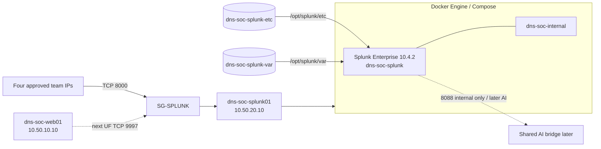
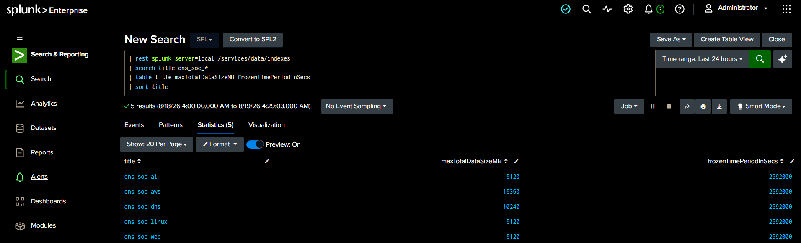

# Splunk Build

**Status:** Gate A complete — Splunk platform ready for trusted data onboarding.

**Implementation owner:** Sonia — Detection Engineer

This folder records the completed Splunk Enterprise platform on `dns-soc-splunk01` and the data-engineering standards that later telemetry must follow. Scenario-specific dashboards, detections, tuning and IR evidence stay in the separate scenario repositories.

## Current platform

| Item | Implemented state |
|---|---|
| EC2 host | `dns-soc-splunk01` — `10.50.20.10` |
| Host OS | Ubuntu 26.04 LTS |
| Host resources | 4 vCPU, ~16 GiB RAM, 100 GiB EBS |
| Container runtime | Docker Engine + Docker Compose |
| Splunk image | `splunk/splunk:10.4.2` |
| Container | `dns-soc-splunk` |
| Restart policy | `unless-stopped` |
| Splunk Web | TCP `8000`, host-bound to `10.50.20.10`, SG access restricted to four approved team `/32` addresses |
| Universal Forwarder receiver | TCP `9997`, host-bound to `10.50.20.10`, SG source restricted to `SG-WEB` for the current phase |
| HEC `8088` | Not host-published; deferred to shared AI integration |
| Management `8089` | Not host-published |
| Public SSH | No SG rule; EC2 administration uses SSM |
| Config persistence | `dns-soc-splunk-etc` → `/opt/splunk/etc` |
| Data/runtime persistence | `dns-soc-splunk-var` → `/opt/splunk/var` |
| Backup | Verified compressed backups of both named volumes |

## Platform architecture



## Data indexes

| Index | Intended data | Max size | Retention | Current phase |
|---|---|---:|---:|---|
| `dns_soc_web` | Nginx access/error telemetry | 5 GiB | 30 days | Next — Web Forwarder |
| `dns_soc_linux` | Selected Linux security/system telemetry | 5 GiB | 30 days | Next — Web Forwarder |
| `dns_soc_aws` | Route 53, VPC Flow Logs, CloudTrail and later applicable AWS DNS telemetry | 15 GiB | 30 days | Planned — AWS logging |
| `dns_soc_dns` | Team-controlled resolver DNS telemetry | 10 GiB | 30 days | Scenario 02 onward |
| `dns_soc_ai` | AI triage/enrichment returned to Splunk | 5 GiB | 30 days | Planned — shared AI foundation |

The indexes were validated after the final platform build with `frozenTimePeriodInSecs=2592000` for all five project indexes.



## Gate A acceptance

Gate A is complete because the team verified:

- Docker Engine and Compose are working;
- the pinned Splunk container starts healthy;
- Splunk Web is reachable through the restricted SG path;
- TCP `9997` accepts receiver connections;
- only required host ports are published;
- project indexes exist with the approved size/retention policy;
- normal container restart recovers cleanly;
- Docker daemon restart recovers the service through `unless-stopped`;
- forced container recreation preserves indexes and receiver configuration through named volumes;
- both persistent volumes can be backed up and the archives validate successfully.

## Next implementation checkpoint

The Splunk platform is deliberately complete **before** real project telemetry is onboarded.

```text
dns-soc-web01
    |
    | Splunk Universal Forwarder
    |
    +-- /var/log/nginx/soclab_access.log
    +-- /var/log/nginx/soclab_error.log
    +-- selected real Linux security/system source
    |
    | TCP 9997 inside SOC-LAB-VPC
    v
dns-soc-splunk01
    |
    v
Validate index / host / source / sourcetype / timestamp / fields
```

The Web Forwarder is the next Gate B task. AWS telemetry follows after that. DNS dashboards and scenario SPL are **not** part of this platform build; they belong to the Scenario 01 repository after trusted telemetry exists.

## Documents

- [`01-platform-deployment.md`](01-platform-deployment.md) — Docker/Splunk architecture and validation
- [`02-data-structure-and-validation.md`](02-data-structure-and-validation.md) — indexes, sourcetypes, naming and data-quality gates
- [`03-backup-recovery-and-operations.md`](03-backup-recovery-and-operations.md) — persistence, restart, backup, recreate and upgrade strategy
- [`04-troubleshooting-and-lessons.md`](04-troubleshooting-and-lessons.md) — engineering lessons from the build
- [`configs/`](configs/) — Compose and environment examples
- [`screenshots/`](screenshots/) — evidence
