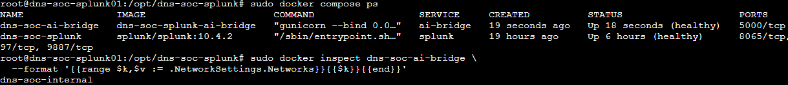

# Flask / OpenAI Bridge Deployment

**Status:** Complete  
**Implementation owner:** [_Musfira_](https://github.com/MUSFIRA-ZAFAR) — **Shared AI Integration**

## Runtime components

| Component | Implemented value |
|---|---|
| Host | `dns-soc-splunk01` |
| Bridge source on host | `/opt/dns-soc-ai-bridge` |
| Runtime secret file | `/etc/dns-soc-ai/ai.env` |
| Container | `dns-soc-ai-bridge` |
| Python base image | `python:3.12-slim` |
| Web framework | Flask |
| WSGI server | Gunicorn |
| Container port | `5000` |
| OpenAI interface | Responses API |
| Validation model setting | `gpt-5.6-terra` via `OPENAI_MODEL` |

The project first proved direct OpenAI API access from the EC2 host before building the Flask application. The API returned the expected test response, confirming project/service-account authentication and model access.

## Reproduction path

The repository-safe bridge files mirror the implementation deployed under `/opt/dns-soc-ai-bridge`. To reproduce the service on the existing Splunk host:

1. copy [`bridge/app.py`](bridge/app.py), [`bridge/Dockerfile`](bridge/Dockerfile) and [`bridge/requirements.txt`](bridge/requirements.txt) to `/opt/dns-soc-ai-bridge`;
2. create `/etc/dns-soc-ai/ai.env` from [`configs/ai.env.example`](configs/ai.env.example), replacing placeholders only on the host;
3. keep the secret file root-owned and mode `600`;
4. use the two-service Compose definition at [`../03-splunk-build/configs/compose.yaml`](../03-splunk-build/configs/compose.yaml);
5. validate and start only the bridge when Splunk is already running:

```bash
cd /opt/dns-soc-splunk
sudo docker compose config --quiet
sudo docker compose up -d --build ai-bridge
sudo docker compose ps
```

Expected steady state:

```text
dns-soc-splunk      healthy
dns-soc-ai-bridge   healthy
```

Do not add a host `ports:` mapping for the AI bridge.

## Application endpoints

### `GET /health`

Returns service health and the configured model name. Docker Compose uses this endpoint for the bridge health check.

### `POST /splunk-webhook`

Processes a Splunk alert in this sequence:

```text
receive JSON
    ↓
normalize native Splunk webhook envelope when present
    ↓
validate common alert schema
    ↓
call OpenAI Responses API
    ↓
enforce strict structured-result schema
    ↓
add request ID + processed time + human-validation flag
    ↓
write to Splunk HEC
```

## Common alert request

The common request contract requires:

```text
alert_id
alert_name
scenario
severity
event_time
evidence
```

`source` is optional. `evidence` remains a flexible JSON object because each scenario has different stable detection fields.

Splunk's built-in webhook wraps the first search result row inside a native alert envelope. The bridge therefore supports both:

1. the common contract directly; and
2. Splunk's native envelope containing `result`.

For a native webhook, the first result row is translated into the common contract and `evidence_json` is decoded into the `evidence` object.

## Structured AI response

The bridge enforces a strict response schema for:

- summary;
- observed indicators;
- network / OSI context;
- suspicion reasons;
- MITRE ATT&CK context;
- Cyber Kill Chain context;
- missing evidence;
- response considerations;
- confidence.

The prompt also tells the model to use `Uncertain` rather than fabricate a framework mapping when evidence is insufficient.

## Repository-safe source

The final repository-safe implementation is stored in:

- [`bridge/app.py`](bridge/app.py)
- [`bridge/Dockerfile`](bridge/Dockerfile)
- [`bridge/requirements.txt`](bridge/requirements.txt)

The JSON files in [`schemas/`](schemas/) are reference/export copies of the same schemas enforced inline by `app.py`; the deployed application does not currently load those files at runtime.

## Compose integration

The existing Splunk service and named volumes were preserved. The only platform change was adding the second `ai-bridge` service on `dns-soc-internal`.

There is intentionally no `ports:` block on the AI bridge service.



*Both services are healthy and the bridge is attached to `dns-soc-internal`; TCP 5000 is shown only as a container port.*
