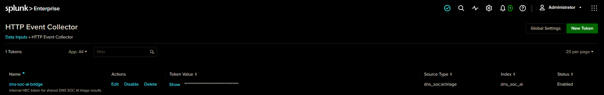
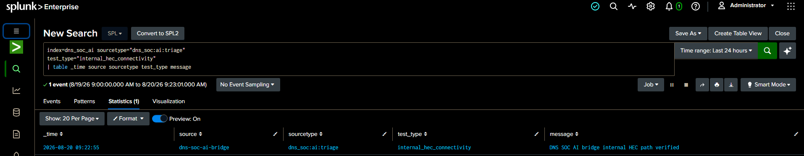

<!-- dns-soc-nav:start -->
[🏠 Repository Home](../README.md) · [📁 04 Ai Integration](README.md)
<!-- dns-soc-nav:end -->


# Splunk HEC & Webhook Integration

**Status:** Complete  
**Implementation owner:** [_Musfira_](https://github.com/MUSFIRA-ZAFAR) — **Shared AI Integration**

## HEC destination

A dedicated internal HEC token was created for AI results.

| Setting | Implemented value |
|---|---|
| Token name | `dns-soc-ai-bridge` |
| Status | Enabled |
| Allowed/default index | `dns_soc_ai` |
| Sourcetype | `dns_soc:ai:triage` |
| HEC endpoint | `https://dns-soc-splunk:8088/services/collector/event` |
| Host/public exposure | None |



*The token is enabled and constrained to the dedicated AI index/sourcetype. The token value itself is not exposed.*

## Internal HEC connectivity

Before wiring HEC into the Flask application, the team sent a single controlled event from the AI bridge container to Splunk.

The event appeared as:

```text
index=dns_soc_ai
sourcetype=dns_soc:ai:triage
source=dns-soc-ai-bridge
test_type=internal_hec_connectivity
```



*This proves container-to-container HEC delivery without publishing TCP 8088 on the EC2 host.*

## Webhook allow-list

Splunk was configured to allow only the intended internal bridge URL:

```ini
[webhook]
enable_allowlist = true
allowlist.dns_soc_ai_bridge = ^http:\/\/dns-soc-ai-bridge:5000\/splunk-webhook$
```

A repository-safe copy is stored at [`configs/splunk-webhook-allowlist.conf.example`](configs/splunk-webhook-allowlist.conf.example).

## Splunk configuration path

HEC was enabled from Splunk Web:

```text
Settings -> Data Inputs -> HTTP Event Collector -> Global Settings
```

The dedicated token was then created from:

```text
Settings -> Data Inputs -> HTTP Event Collector -> New Token
```

The token is restricted to `dns_soc_ai` and uses `dns_soc:ai:triage`. The real token value is stored only in the host secret file.

The webhook allow-list is stored in Splunk's persistent configuration at:

```text
/opt/splunk/etc/system/local/alert_actions.conf
```

After changing the allow-list, effective settings can be checked with:

```bash
sudo docker exec -u splunk dns-soc-splunk \
  /opt/splunk/bin/splunk btool alert_actions list webhook --debug
```

## Native Splunk alert envelope

The first scheduled synthetic alert proved an important integration detail: Splunk's webhook action sends alert metadata plus the first triggering result row rather than the bridge's common schema directly.

The bridge was updated with `normalize_alert_payload()` so the shared service can accept:

```text
Splunk native webhook envelope
        ↓
result.alert_id / alert_name / scenario / severity / event_time / source
result.evidence_json
        ↓
common bridge alert contract
```

This keeps later scenario repositories simple: their final detection only needs to produce a clean, analyst-ready result row and a scenario-specific evidence mapping.

## Scheduled synthetic alert

The foundation test used a temporary scheduled saved alert with a webhook action pointed at:

```text
http://dns-soc-ai-bridge:5000/splunk-webhook
```

The test schedule was used only to exercise Splunk's real scheduler + alert-action path. It is not a Scenario 01 detection and should not be treated as production alert logic.

A clean standalone webhook-configuration screenshot was not included in the supplied evidence pack. The repository therefore does not fabricate one; webhook behavior is instead supported by the validated effective configuration and successful end-to-end alert flow documented here.


<!-- dns-soc-footer:start -->
<div align="center">

[🏠 Repository Home](../README.md) · [📁 04 Ai Integration](README.md)

<sub>DNSentinel Lab · Controlled DNS security training documentation</sub>

</div>
<!-- dns-soc-footer:end -->
