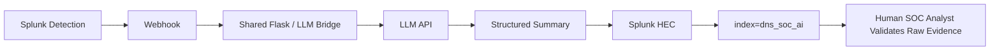

# Shared AI-Assisted Alert Summarization

**Status:** **NEXT — ready to implement.** Web Gate B and AWS Gate C are complete, so the shared AI foundation is now the only unfinished common-infrastructure phase before Scenario 01 detection engineering.

The AI component is **shared infrastructure** for all four scenarios. It is built once, then each scenario adds a small profile that maps its stable alert fields and context into the common bridge. AI assists the analyst; it does not make the final triage or response decision.



## Why this is built after trusted telemetry

The bridge should consume a stable detection payload, not influence how logs are collected or how the detection is designed.

```text
Web Forwarder + data quality  COMPLETE
          |
AWS telemetry + data quality COMPLETE
          |
          v
Shared AI foundation         NEXT
          |
Scenario detection reaches stable fields
          |
          v
Scenario-specific AI profile
```

This keeps the telemetry and SPL logic evidence-driven while allowing every later scenario to reuse the same integration code.


## Ready-state checkpoint

The prerequisites that originally blocked this phase are now complete:

- Splunk Enterprise `10.4.2` is stable on Ubuntu 24.04 LTS;
- KV Store is healthy;
- `dns_soc_ai` exists with the 30-day project retention policy;
- Web/Nginx telemetry is trusted;
- all four AWS telemetry families are trusted in `dns_soc_aws`;
- TCP `8088` is still not publicly exposed, so the HEC return path can be designed as an internal integration.

The shared bridge can therefore be built without changing the completed telemetry architecture.

## Shared foundation scope

The common implementation will cover:

- second Docker container on the Splunk EC2 host;
- internal Docker network communication;
- Flask webhook endpoint;
- safe LLM API secret handling;
- a common alert request schema;
- a common structured AI response schema;
- error/timeout handling;
- HEC return path to `dns_soc_ai`;
- `sourcetype=dns_soc:ai:triage`;
- health checks and a synthetic end-to-end test;
- analyst validation of correct and incorrect AI output.

TCP `8088` is not publicly exposed. When HEC is introduced, it is used through the controlled internal integration path.

## Common output contract

The exact schema is finalized during implementation, but the shared output should remain focused on analyst support:

```text
summary
observed indicators
why the activity may be suspicious
suggested MITRE mapping
questions / evidence still requiring verification
possible response considerations
```

The model must not automatically mark an event true-positive/false-positive or execute containment.

## Scenario profiles

The bridge code stays common, while scenario context is versioned separately:

| Scenario | Example profile focus |
|---|---|
| 01 — DNS Recon | record-type diversity, query rate, source, queried names, follow-up web activity |
| 02 — DGA / NXDOMAIN | NXDOMAIN ratio, unique names, label/domain length, query rate, client behavior |
| 03 — Fast Flux | answer/IP churn, TTL, destination changes and flow context |
| 04 — DNS Tunneling | long/encoded labels, TXT/A patterns, frequency, parent domain and endpoint/network context |

Scenario 02 may also add a separate statistical/ML anomaly-detection feature. That is a detection method, not a replacement for the shared LLM summarization bridge.

## Initial shared ownership

The initial foundation follows the Task 1 responsibilities already assigned by the team:

| Team member | Responsibility |
|---|---|
| Sonia | Define alert fields, payload requirements and what the AI should analyze |
| Abdul-Rehman | Coordinate Flask deployment, Docker/network path, API configuration and integration readiness |
| Musfira | Validate whether AI summaries are useful and consistent with raw Splunk evidence |
| Lubaba | Review whether AI response suggestions are appropriate and remain human-approved |

Later scenario repositories can rotate detection/SOC/IR ownership without rebuilding the shared bridge.

## Success condition

AI integration is successful only if the SOC Analyst can compare the generated summary against the raw Splunk evidence and clearly explain where the AI was correct, incomplete or wrong.


## Handoff to scenario repositories

When the shared bridge passes its synthetic end-to-end test, the **common infrastructure build is complete**.

Scenario repositories then add only their own profile/payload mapping after the corresponding detection has stable evidence fields. Scenario-specific AI profiles do not redesign the common Flask/LLM/HEC path.

The scenario workflow and repository layout are standardized in [`../00-project-design/scenario-documentation-standard.md`](../00-project-design/scenario-documentation-standard.md). Any later scenario-specific AWS additions are tracked separately in [`../00-project-design/scenario-infrastructure-roadmap.md`](../00-project-design/scenario-infrastructure-roadmap.md).
