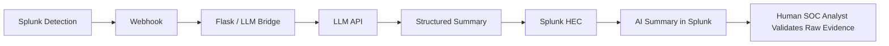

# AI-Assisted Alert Summarization

**Status:** Planned — implementation has not started yet.

The AI component is designed to assist the analyst after a Splunk detection fires. It does **not** make the final triage or response decision.

Planned outputs include a plain-English alert summary, suspicious indicators, a suggested MITRE technique, and investigation questions. The SOC Analyst must compare that output with the raw Splunk evidence before assigning a disposition.

When implemented, this folder will contain the bridge code/configuration, prompt contract, webhook/HEC setup notes, safe secret handling, test cases and examples of useful vs. incorrect AI output.
