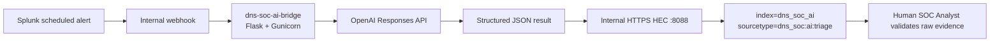

# Shared AI-Assisted Alert Triage

**Status:** **Complete.** The shared AI foundation is deployed and validated. The common AWS / Web / Splunk / AI platform is now complete; scenario repositories reuse this bridge after their detection fields are stable.

The bridge is shared infrastructure for all four DNS SOC scenarios. It accepts a Splunk alert result, validates and normalizes the payload, asks the OpenAI API for a schema-controlled analyst aid, and writes the structured result back to Splunk for human review.



## Final implementation state

| Item | Implemented state |
|---|---|
| Host | Existing `dns-soc-splunk01`; no new EC2 |
| Bridge container | `dns-soc-ai-bridge` |
| Application | Flask served by Gunicorn |
| Docker network | `dns-soc-internal` |
| Bridge port | TCP `5000`, Docker-internal only |
| Splunk HEC | TCP `8088`, Docker-internal only |
| OpenAI API | Responses API |
| Model used during foundation validation | `gpt-5.6-terra`, configured through `OPENAI_MODEL` |
| Splunk destination | `index=dns_soc_ai` |
| Splunk sourcetype | `dns_soc:ai:triage` |
| Webhook endpoint | `http://dns-soc-ai-bridge:5000/splunk-webhook` |
| Health endpoint | `/health` |
| AI decision boundary | Advisory only; `human_validation_required=true` |

No AWS security-group rule was added for TCP `5000` or `8088`. Only the existing Splunk Web and Universal Forwarder receiver remain host-published from the Compose stack.

## What the bridge returns

The response schema is intentionally structured so an analyst can review evidence instead of reading an unrestricted free-text answer:

```text
summary
observed_indicators
network_context
  primary_osi_layer
  related_layers
  protocols
  explanation
suspicion_reasons
mitre_attack
  tactic
  technique_id
  technique_name
  explanation
cyber_kill_chain
  stage
  explanation
missing_evidence
response_considerations
confidence
human_validation_required
```

The model is instructed to prefer uncertainty over unsupported assumptions. MITRE ATT&CK and Cyber Kill Chain fields are analyst context, not final classifications.

## Validation completed

The shared foundation was proven without using the real Scenario 01 detection:

- direct OpenAI API authentication succeeded from `dns-soc-splunk01`;
- both Docker containers were healthy on `dns-soc-internal`;
- a dedicated HEC token wrote only to `dns_soc_ai` using `dns_soc:ai:triage`;
- the bridge accepted Splunk's native webhook envelope and normalized the first result row into the common alert contract;
- a strong synthetic alert produced structured analyst context in Splunk;
- an incomplete synthetic alert returned low confidence, `Uncertain` framework context and a meaningful missing-evidence list;
- human review confirmed the strong and incomplete outputs behaved differently as intended;
- an invalid payload returned HTTP `400` / `schema_validation_failed` and created no bad AI event;
- final strong-vs-incomplete comparison passed with `human_validation_required=true` for both results.

The strong synthetic result also demonstrated why framework mappings remain advisory: the model suggested `T1595 — Active Scanning`, while the analyst must evaluate the scenario's intended `T1590.002` DNS reconnaissance mapping against the real evidence.

## Documents

- [`01-architecture-and-security.md`](01-architecture-and-security.md) — final network/security boundary and trust model
- [`02-bridge-deployment.md`](02-bridge-deployment.md) — deployed Flask/OpenAI/Docker implementation
- [`03-splunk-hec-and-webhook.md`](03-splunk-hec-and-webhook.md) — HEC, webhook allow-list and native Splunk payload handling
- [`04-validation-and-operations.md`](04-validation-and-operations.md) — strong/incomplete/failure tests, human validation and operating checks
- [`bridge/`](bridge/) — repository-safe bridge source, Dockerfile and dependencies
- [`configs/`](configs/) — safe environment and Splunk allow-list examples
- [`schemas/`](schemas/) — reference copies of the request and response schemas enforced by `app.py`
- [`validation/`](validation/) — reusable synthetic SPL and final validation searches
- [`screenshots/`](screenshots/) — selected implementation evidence

## Scenario handoff

The bridge stays scenario-neutral. A scenario repository adds only its own stable evidence mapping/profile after the detection is ready:

```text
scenario detection
      ↓
analyst-ready evidence fields
      ↓
scenario profile / payload mapping
      ↓
shared AI bridge
      ↓
dns_soc_ai
      ↓
human validation
```

Scenario 01 detection engineering is now active in its dedicated repository. Future scenario-specific infrastructure remains tracked in [`../00-project-design/scenario-infrastructure-roadmap.md`](../00-project-design/scenario-infrastructure-roadmap.md).
