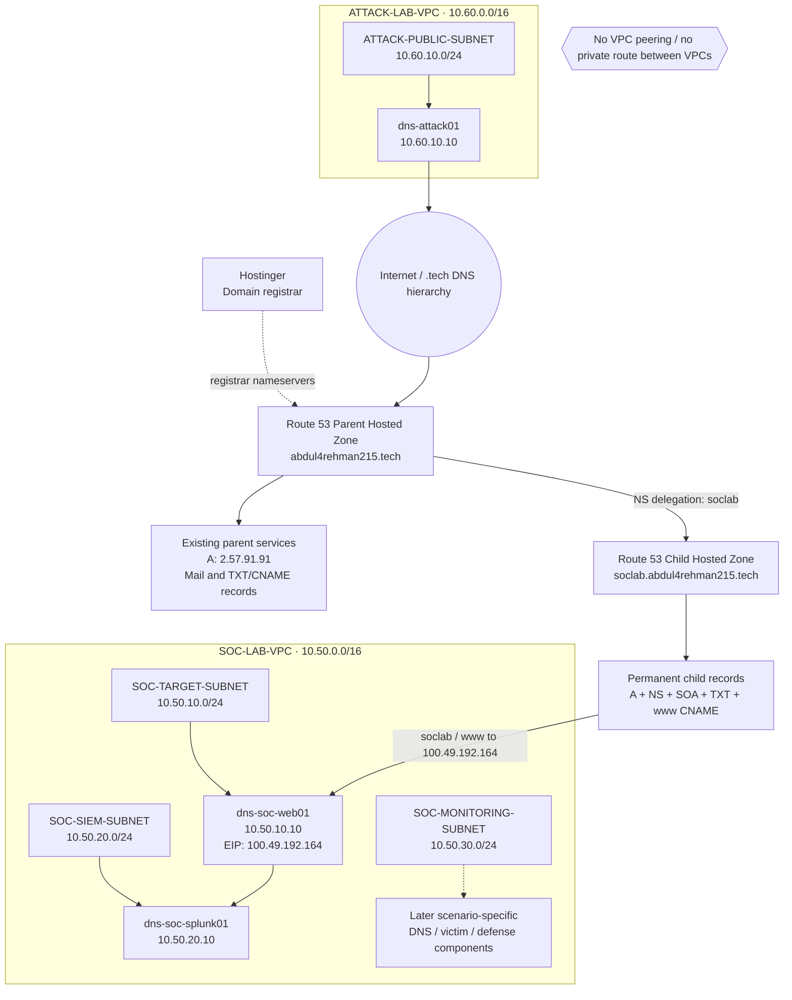

# DNS Attack, Detection & Response Lab - Infrastructure

**AWS · Splunk Enterprise · DNS Security · MITRE ATT&CK · Incident Response · AI-Assisted Analysis**

This repository contains the shared infrastructure and platform design for a four-person DNS-focused SOC lab. It records the AWS network, compute, DNS authority, Splunk foundation and later AI integration that support the separate attack-scenario repositories.

The lab runs in **AWS us-east-1 (N. Virginia)** with a deliberately separated attacker VPC and SOC VPC. Public DNS is split into a Route 53 parent zone and a delegated Route 53 child zone for the lab namespace.

## Architecture at a glance

Hostinger remains the registrar. The parent domain is authoritative in Route 53, and the parent zone delegates `soclab.abdul4rehman215.tech` to a separate Route 53 child zone. The child zone now has a stable five-record baseline: A, NS, SOA, a training TXT fixture and `www` CNAME. Both web hostnames resolve to the same public web target. The attacker still reaches the public lab through the Internet rather than through a private route into the SOC VPC.

## Four scenarios

The common infrastructure in this repository supports four scenario repositories maintained separately by the team.

| Scenario | Focus | MITRE ATT&CK | Main learning goal |
|---|---|---|---|
| 01 | DNS Reconnaissance & Enumeration | T1590.002 | Detect abnormal DNS record enumeration and investigate follow-up activity |
| 02 | DGA + High NXDOMAIN | T1568.002 | Identify generated-domain behavior through DNS patterns and NXDOMAIN activity |
| 03 | Fast Flux DNS | T1568.001 | Correlate changing DNS answers, TTL behavior and destination changes |
| 04 | DNS Tunneling | T1071.004 / T1572 | Detect suspicious encoded DNS behavior and validate containment |

MITRE mappings describe the behavior the team intends to simulate and are refined if the final implementation differs from the plan.

## Team model

The team rotates through four roles so every member practices more than one part of the SOC lifecycle.

| Scenario | Project Lead | SOC Analyst | Detection Engineer | IR / Defender |
|---|---|---|---|---|
| DNS Recon | Abdul-Rehman | Musfira | Sonia | Lubaba |
| DGA | Musfira | Sonia | Lubaba | Abdul-Rehman |
| Fast Flux | Sonia | Lubaba | Abdul-Rehman | Musfira |
| DNS Tunneling | Lubaba | Abdul-Rehman | Musfira | Sonia |

The Project Lead also operates the authorized simulation for that scenario and records ground-truth timing. The SOC Analyst remains the human decision-maker even when AI-assisted summaries are used.

## Current build status

| Area | Status |
|---|---|
| Project design | Locked and documented |
| AWS identity, MFA, budget and SSM role | Completed |
| VPCs, subnets, IGWs and route tables | Completed |
| Baseline security groups | Completed |
| EC2 deployment | Completed |
| Route 53 parent migration | Completed |
| Route 53 child zone and parent-to-child delegation | Completed |
| Public DNS validation | Completed |
| Static child DNS / Scenario 01 fixtures | Completed |
| Nginx / HTTPS for main + `www` hostnames | Completed |
| Splunk Enterprise deployment | **Next** |
| AWS log onboarding | Planned |
| Scenario execution | Maintained in separate scenario repositories |

## Repository map

- [`00-project-design/`](00-project-design/) - scope, roles, scenario model, DNS scenario plan and roadmap
- [`01-network-architecture/`](01-network-architecture/) - VPC blueprint, CIDRs, DNS authority design, controls and traffic flows
- [`02-aws-build/`](02-aws-build/) - implemented AWS configuration and validation evidence
- [`03-splunk-build/`](03-splunk-build/) - Splunk deployment and data onboarding as it is implemented
- [`04-ai-integration/`](04-ai-integration/) - AI-assisted alert summarization design and later implementation

The four attack scenarios are now maintained in separate repositories. This infrastructure repository keeps the common architecture and build record so the same foundation does not have to be duplicated across every scenario.

## Documentation rule

The repository separates **design** from **implementation**. Architecture files explain how the lab is intended to work. Build files record what was actually configured and how it was validated. Scenario repositories contain scenario-specific preparation, execution, evidence, analysis and response.

> This lab is for controlled security training on infrastructure and domains owned by, or explicitly authorized for, the team.
