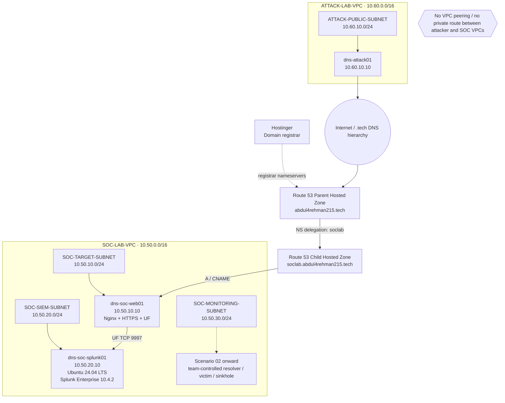
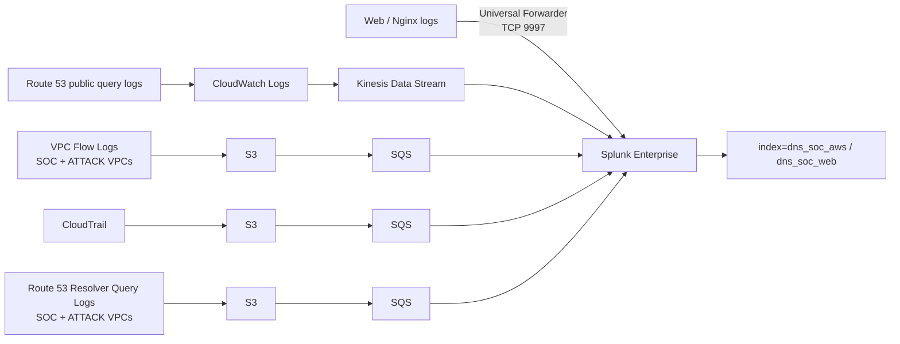

# DNS Attack, Detection & Response Lab - Infrastructure

**AWS · Splunk Enterprise · DNS Security · MITRE ATT&CK · Incident Response · AI-Assisted Analysis**

This repository is the shared infrastructure record for a four-person DNS-focused SOC lab. It contains the common AWS network, public DNS, web target, Splunk platform, trusted telemetry pipelines and the shared AI integration that will support the separate scenario repositories.

The lab runs in **AWS `us-east-1` (N. Virginia)**. The attacker and SOC environments stay in separate VPCs with **no VPC peering and no private route between them**.

## Current checkpoint

The shared platform has reached the end of its telemetry build:

```text
AWS identity / VPC / routing / SSM        COMPLETE
Route 53 authority and delegation        COMPLETE
Nginx + HTTPS                            COMPLETE
Splunk Gate A - platform                 COMPLETE
Splunk Gate B - web telemetry            COMPLETE
Splunk Gate C - AWS telemetry            COMPLETE
                                         |
                                         v
Shared AI foundation                     NEXT
                                         |
                                         v
Scenario 01 detection engineering        Separate scenario repository
```

The next infrastructure task is the **shared Flask / LLM bridge** in [`04-ai-integration/`](04-ai-integration/). Scenario-specific dashboards, SPL detections, tuning, simulations, analyst findings and response evidence remain outside this repository.

## Architecture at a glance



> Hostinger remains the registrar. Route 53 is authoritative for the parent domain and delegates the lab namespace to a separate child hosted zone. The child zone keeps a stable baseline for the public lab. The attack host reaches the lab through public DNS and the public web target, not through a private SOC route.

## Trusted telemetry now available



The AWS collection layer uses the supported Splunk Add-on for AWS `8.2.1`. Real sourcetypes were recorded from live data instead of being invented in advance:

| Telemetry | Destination index | Actual sourcetype |
|---|---|---|
| Route 53 public authoritative query logs | `dns_soc_aws` | `aws:kinesis` |
| VPC Flow Logs | `dns_soc_aws` | `aws:cloudwatchlogs:vpcflow` |
| CloudTrail | `dns_soc_aws` | `aws:cloudtrail` |
| Route 53 Resolver Query Logs | `dns_soc_aws` | `aws:s3` |
| Nginx access telemetry | `dns_soc_web` | `dns_soc:nginx:access` |

> AWS VPC Resolver Query Logging is already active for the existing VPCs. This is **not** the same thing as the future team-controlled resolver planned for Scenario 02. `dns-soc-resolver01`, `dns-soc-victim01` and the sinkhole/deny path have not been deployed yet. DNS Firewall is not required by the current locked scenario plan.

## Four scenarios

The common infrastructure in this repository supports four scenario repositories maintained separately by the team.

| Scenario | Focus | MITRE ATT&CK | Main learning goal | Additional infrastructure later |
|---|---|---|---|---|
| 01 | DNS Reconnaissance & Enumeration | T1590.002 | Detect abnormal DNS record enumeration and investigate follow-up activity | None expected after shared AI is ready |
| 02 | DGA + High NXDOMAIN | T1568.002 | Identify generated-domain behavior and introduce the defender-controlled resolver/sinkhole path | Resolver + victim + reusable sinkhole path |
| 03 | Fast Flux DNS | T1568.001 | Correlate changing DNS answers, TTL behavior and destination changes | Temporary controlled endpoints + short-TTL Fast Flux DNS changes |
| 04 | DNS Tunneling | T1071.004 / T1572 where implemented behavior fits | Detect suspicious encoded DNS behavior and prove containment through the defender-controlled DNS path | Reuse resolver/victim; optional authoritative DNS endpoint only if the final design requires it |

MITRE mappings describe the behavior the team intends to simulate and are reviewed again if the final implementation changes.

### Scenario-specific infrastructure after the shared build

The main AWS/Splunk foundation is already complete through Gate C. Once the shared AI bridge is complete, common infrastructure is considered finished. Later AWS work is created only when a scenario genuinely needs it.

```text
Shared AI foundation
        |
        v
COMMON INFRASTRUCTURE COMPLETE
        |
        +--> Scenario 01: reuse existing platform
        |
        +--> Scenario 02: resolver + victim + reusable sinkhole
        |
        +--> Scenario 03: temporary controlled Fast Flux resources
        |
        +--> Scenario 04: reuse defender DNS path + optional DNS service only if needed
```

See [`00-project-design/scenario-infrastructure-roadmap.md`](00-project-design/scenario-infrastructure-roadmap.md) for the build decisions and [`00-project-design/scenario-documentation-standard.md`](00-project-design/scenario-documentation-standard.md) for the common 20-part SOC workflow, networking view, MITRE discipline and dashboard engineering standard.

## Team model

The team rotates through four roles so every member practices more than one part of the SOC lifecycle.

| Scenario | Project Lead | SOC Analyst | Detection Engineer | IR / Defender |
|---|---|---|---|---|
| DNS Recon | Abdul-Rehman | Musfira | Sonia | Lubaba |
| DGA | Musfira | Sonia | Lubaba | Abdul-Rehman |
| Fast Flux | Sonia | Lubaba | Abdul-Rehman | Musfira |
| DNS Tunneling | Lubaba | Abdul-Rehman | Musfira | Sonia |

## Current build status

| Area | Status |
|---|---|
| Project design | **Complete** / maintained as the shared design baseline |
| AWS identity, MFA, budget and SSM role | **Complete** |
| VPCs, subnets, IGWs and route tables | **Complete** |
| Baseline security groups | **Complete** |
| Scenario 01 EC2 deployment | **Complete** |
| Route 53 parent migration and child delegation | **Complete** |
| Public DNS validation and static child-zone fixtures | **Complete** |
| Nginx / HTTPS for main + `www` hostnames | **Complete** |
| Splunk Enterprise platform / Gate A | **Complete** |
| Five project indexes + 30-day retention | **Complete** |
| Web Universal Forwarder + Nginx data quality / Gate B | **Complete** |
| Route 53 public authoritative telemetry | **Complete** |
| VPC Flow Logs | **Complete** |
| CloudTrail | **Complete** |
| Route 53 Resolver Query Logging | **Complete** |
| Combined AWS telemetry data quality / Gate C | **Complete** |
| Shared AI foundation | **Next** |
| Common/shared infrastructure | Complete after AI foundation passes its validation gate |
| Scenario 01 additional infrastructure | None currently expected |
| Scenario 02 defender DNS infrastructure | **Planned when Scenario 02 begins** |
| Scenario 03 temporary Fast Flux infrastructure | **Planned when Scenario 03 begins** |
| Scenario 04 tunneling-specific infrastructure | **Conditional / planned when Scenario 04 begins** |
| Scenario-specific detections and exercises | Separate scenario [repositories](https://github.com/orgs/DNSentinel-Lab/repositories) |

## Repository map

- [`00-project-design/`](00-project-design/) - scope, roles, scenario model, scenario infrastructure roadmap, documentation standard, DNS plan and project roadmap
- [`01-network-architecture/`](01-network-architecture/) - VPC blueprint, CIDRs, DNS authority design, controls and traffic flows
- [`02-aws-build/`](02-aws-build/) - implemented AWS configuration, including security telemetry
- [`03-splunk-build/`](03-splunk-build/) - Splunk platform, Web Forwarder onboarding, AWS Add-on inputs, validation and operations
- [`04-ai-integration/`](04-ai-integration/) - shared AI-assisted alert summarization design; implementation is the next shared-infrastructure phase

## Documentation rule

The repository separates **design** from **implementation**:

- architecture files explain how the lab is intended to work;
- build files record what was actually configured and how it was validated;
- troubleshooting records the useful engineering lesson, not repetitive trial-and-error history;
- scenario repositories contain scenario-specific preparation, execution, detection, analysis, response and evidence.

> This lab is for controlled security training on infrastructure and domains owned by, or explicitly authorized for, the team.
