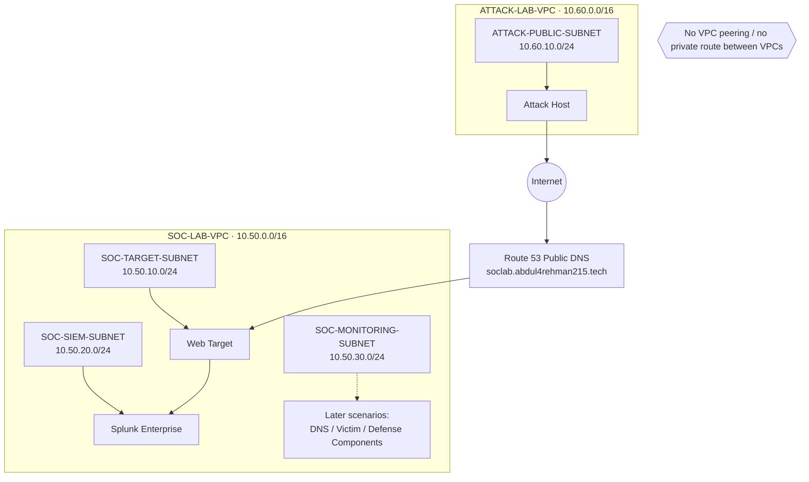

# DNS Attack, Detection & Response Lab

**AWS · Splunk Enterprise · DNS Security · MITRE ATT&CK · Incident Response · AI-Assisted Analysis**

A four-person SOC lab built to practice the full security workflow around DNS: design the network, generate controlled attack behavior, collect telemetry, build detections, investigate alerts, respond to incidents, and verify containment.

The project uses one shared AWS lab in **us-east-1 (N. Virginia)** with a deliberately separated attacker network and SOC network. The lab is built in stages so each scenario adds only the infrastructure and telemetry it actually needs.

## Architecture at a glance

The attacker does not receive a private route into the SOC VPC. Public-facing scenario traffic reaches the lab through Internet-facing services and public DNS.

## Four scenarios

| Scenario | Focus | MITRE ATT&CK | Main learning goal |
|---|---|---|---|
| 01 | DNS Reconnaissance & Enumeration | T1590.002 | Detect abnormal DNS record enumeration and investigate follow-up activity |
| 02 | DGA + High NXDOMAIN | T1568.002 | Identify generated-domain behavior through DNS patterns and NXDOMAIN activity |
| 03 | Fast Flux DNS | T1568.001 | Correlate changing DNS answers, TTL behavior, and destination changes |
| 04 | DNS Tunneling | T1071.004 / T1572 | Detect suspicious encoded DNS behavior and validate containment |

MITRE mappings describe the behavior the team intends to simulate. They are refined if the final implementation differs from the plan.

## Team model

The team rotates through four roles so every member practices more than one part of the SOC lifecycle.

| Scenario | Project Lead | SOC Analyst | Detection Engineer | IR / Defender |
|---|---|---|---|---|
| DNS Recon | Abdul-Rehman | Musfira | Sonia | Lubaba |
| DGA | Musfira | Sonia | Lubaba | Abdul-Rehman |
| Fast Flux | Sonia | Lubaba | Abdul-Rehman | Musfira |
| DNS Tunneling | Lubaba | Abdul-Rehman | Musfira | Sonia |

The Project Lead also operates the authorized simulation for that scenario and records ground-truth timing. The SOC Analyst remains the human decision-maker even when AI-assisted summaries are used.

## Current build status

| Area | Status |
|---|---|
| Project design | Locked and documented |
| AWS identity, MFA, budget and SSM role | Completed |
| VPCs, subnets, IGWs and route tables | Completed |
| Baseline security groups | Completed |
| EC2 deployment | Completed |
| Route 53 lab subdomain | **Next** |
| Splunk Enterprise deployment | Planned |
| AWS log onboarding | Planned |
| Scenario 01 execution | Planned |

## Repository map

- [`00-project-design/`](00-project-design/) — scope, roles, scenarios and roadmap
- [`01-network-architecture/`](01-network-architecture/) — network blueprint, CIDRs, controls and traffic flows
- [`02-aws-build/`](02-aws-build/) — implementation record and AWS evidence
- [`03-splunk-build/`](03-splunk-build/) — Splunk deployment and data onboarding as it is implemented
- [`04-ai-integration/`](04-ai-integration/) — AI-assisted alert summarization design and later implementation
- [`scenario-01-dns-recon/`](scenario-01-dns-recon/) — DNS reconnaissance exercise
- [`scenario-02-dga/`](scenario-02-dga/) — DGA / NXDOMAIN exercise
- [`scenario-03-fast-flux/`](scenario-03-fast-flux/) — Fast Flux exercise
- [`scenario-04-dns-tunneling/`](scenario-04-dns-tunneling/) — DNS tunneling exercise
- [`lessons-learned/`](lessons-learned/) — decisions, failures, fixes and improvements worth carrying forward

## Documentation rule

The repository separates **design** from **implementation**. Architecture files explain what the lab is supposed to do. Build files prove what was actually configured. Scenario folders contain only scenario-specific preparation, execution, evidence, analysis and response.

> This lab is for controlled security training on infrastructure and domains owned by, or explicitly authorized for, the team.
